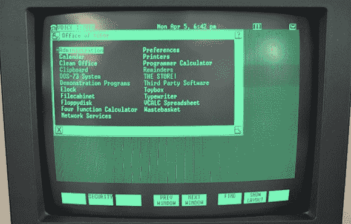

# VCF 东部:PR1ME 和美国电话电报公司 Unix 机器

> 原文：<https://hackaday.com/2014/04/08/vcf-east-pr1me-and-att-unix-boxes/>

在上周末的复古电脑节上，有一个 80 年代的小型 8 位和 16 位家用电脑的精彩展示，大量基于 PDP 和 VAX 的小型机，甚至还有一些 UNIVAC 和克雷形式的非常大的熨斗。你可能认为这是计算历史的一个很好的代表，但实际上在历史现实中有一个巨大的差距。也就是说，不是由 DEC 制造的工作站和小型计算机。

伊恩·普里默斯是认识到这一缺点的极少数人之一，他带来了自己的微型计算机 T1。这是一个巨大的，“两个半机架，并排”运行 PRIMOS 的计算机，PRIMOS 是用 FORTRAN 编写的操作系统。当然，这使得它非常受工程团队的欢迎，但这并不意味着[Ian]不能从中获得乐趣。他设置了两个终端，一个运行地牢(即 Zork pre-Infocom)和一个基于文本的月球着陆器游戏。

因为 VCF 东区是在新泽西举行的，所以出现一些老式的美国电话电报公司 Unix 盒子也就不足为奇了。[Anthony Stramaglia]带来了一些非常酷的老式 Unix 工作站，可以追溯到 80 年代早期到中期。[在视频](https://www.youtube.com/watch?v=nYy1VlksJtg)中，他展示了两个 AT & T 盒子。第一个是[UNIX PC](http://en.wikipedia.org/wiki/AT%26T_Unix_PC)，包含一个 10 MHz 主频的 68010。接下来是 UNIX PC 的老大哥， [3B2 400](http://en.wikipedia.org/wiki/3B_series_computers#3B2) 。这是 80 年代贝尔实验室几乎每张桌子上都有的工作站，这意味着这是[Ken Thompson]和[Dennis Ritchie]在 UNIX 上工作时使用的同一台计算机。

[https://www.youtube.com/embed/OAzRqy83lZ8?version=3&rel=1&showsearch=0&showinfo=1&iv_load_policy=1&fs=1&hl=en-US&autohide=2&wmode=transparent](https://www.youtube.com/embed/OAzRqy83lZ8?version=3&rel=1&showsearch=0&showinfo=1&iv_load_policy=1&fs=1&hl=en-US&autohide=2&wmode=transparent)

[https://www.youtube.com/embed/nYy1VlksJtg?version=3&rel=1&showsearch=0&showinfo=1&iv_load_policy=1&fs=1&hl=en-US&autohide=2&wmode=transparent](https://www.youtube.com/embed/nYy1VlksJtg?version=3&rel=1&showsearch=0&showinfo=1&iv_load_policy=1&fs=1&hl=en-US&autohide=2&wmode=transparent)