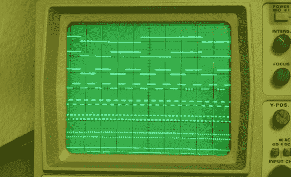

# 将模拟示波器变成逻辑分析仪

> 原文：<https://hackaday.com/2014/04/09/turning-an-analog-scope-into-a-logic-analyzer/>

当[Marco]计划建造一个存储示波器时，他意识到用一个小设备在模拟示波器上显示八个数字信号将非常有用。这恰好是一个简单的逻辑分析仪的准确描述，并设法[将他的想法变成一个整洁的小项目](http://littleserver.spdns.org/DIGIMUX.php)(德语，谷歌[翻译](http://translate.google.com/translate?sl=de&tl=en&js=y&prev=_t&hl=en&ie=UTF-8&u=http%3A%2F%2Flittleserver.spdns.org%2FDIGIMUX.php&edit-text=&act=url))。

这种操作的理论出奇的简单，用几个小时就能完成的事情，用几个小时就能有一个储存合理的黑客空间或零件抽屉。时钟发生器和二进制计数器馈入简单 R2R DAC 的低三位，而 8 路输入馈入 8 路输入多路复用器并发送至 DAC 的最后一位。在没有连接到逻辑分析仪输入的情况下，示波器的输出将只是一个 8 步斜坡，在屏幕上显示为八条水平线。将一些东西连接到逻辑分析仪的输入端，一个极其原始但仍然非常有用的逻辑分析仪出现在屏幕上。

虽然它不是最好的分析器，但它可以在一两个小时内拼凑起来，并且其功能足以调试一些简单的电路或计算项目中的一些时序。