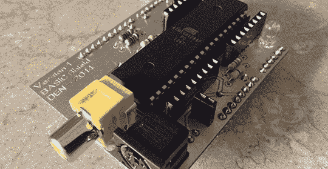

# 一台出色的基本计算机

> 原文：<https://hackaday.com/2014/04/10/an-exceptional-basic-computer/>

自从[丹]开始使用微控制器以来，他完全被这些芯片本质上是低性能计算机这一事实迷住了。一旦他听到 TinyBASIC 的风声，他决定试着创造一种简单的微型计算机，这对于过去的 8 位老式微型计算机来说非常简单。

该计算机构建在 Arduino shield 上，使用 TinyBASIC、TVout 库和 PS/2 键盘库。在拼凑了一小段代码后，Arduino IDE 提醒[Dan]TV out 和 PS/2 库互不兼容。这启发了[Dan]使用 ATMega328P 作为运行 TVout 库的协处理器，并使用大容量的 ATMega1284P 作为 TinyBASIC 和 PS/2 库的主页。

使用最少的元件将电路烧结在一起，并用铜板铣出 PCB。电路板镀锡后，[Dan]有了一台漂亮的简约复古电脑，有将近 14kB 的空闲内存和一个 RCA 显示屏。

未来版本的构建可能会基于 Arduino Mega，允许 720×480 的电视分辨率。此外，还有一个 SD 卡插槽，led，pots，甚至可能是 I2C 和 SPI 的接头。