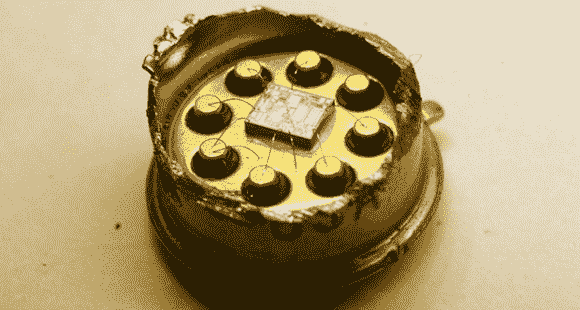

# 假音响发烧友运算放大器被揭露

> 原文：<https://hackaday.com/2014/04/10/fake-audiophile-opamps-revealed/>

OPA627 是一款古老、流行且非常高端的运算放大器，是最具鉴赏力的音响发烧友所钟爱的设备。这种芯片通常售价至少为 15 美元，但当[Zeptobars]在 ebay 上发现一些这种昂贵的芯片售价为 2 美元时，他的好奇心被激起了。这里有点不对劲。

[Zeptobars]以他的解封和高分辨率摄影技巧而闻名，所以他切开了一个真正的 OPA627 的罐子，溶解了一个便宜得不可思议的 ebay 芯片，露出了骰子。在显微镜下，他在真正的芯片上发现了一个惊人的工程设计——激光调整电阻，甚至还有一点不错的模具艺术。

易趣芯片，如果是真的，看起来会一样。它没有。易趣芯片只包含一个激光微调电阻，看起来是一个更简单的电路。经过一番研究后，[Zeptobars]发现它实际上是一个 AD774 运算放大器。差别很小，但 AD774 的噪声仍然高得多，高保真音响发烧友可以用他们 300 美元的无氧音量旋钮轻松区分这一点。

这不是[Zeptobars]遇到的第一个伪造零部件的例子。他已经在之前发现了假的 [FTDI 芯片，我们正在数着日子，直到他有时间把一些明显伪造的 ebay 6581 SID 芯片放到显微镜下。](http://hackaday.com/2014/02/19/ft232rl-real-or-fake/)