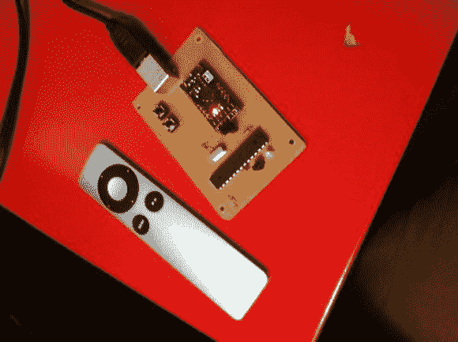

# 红外线忍者——一种电脑遥控接收器

> 原文：<https://hackaday.com/2014/04/10/the-infra-ninja-a-pc-remote-receiver/>

懒惰有时会产生最伟大的发明。让事情减少你的努力很可能是最大的激励因素之一。所以当[凯尔]不得不起床关掉电脑上的网飞时…他决定做点什么。

他已经有了一个苹果遥控器，我们不得不承认，这是一个漂亮、简单和优雅的控制杆——所以他决定用它来控制他的非苹果电脑。他很快使用 good 'ol [墨粉转移方法](http://hackaday.com/2010/05/07/toner-transfer-explained-step-by-step/)制作了一个简单的 PCB，然后用一个 Bareduino、一个 CP2102 USB 2.0 到 TTL UART 6PIN 串行转换器、一个 IR 接收器、一个 USB 插孔、接头引脚和一些 LED 和触觉开关填充它。

上传[代码](https://github.com/philosiraptor/INFRA-NINJA)有点棘手(你必须移除跳线块)，但接下来只需要连接到它并用 Arduino IDE 传输它。说明书有点短，但是[凯尔]承诺如果你真的感兴趣，他会帮助你解决任何问题！