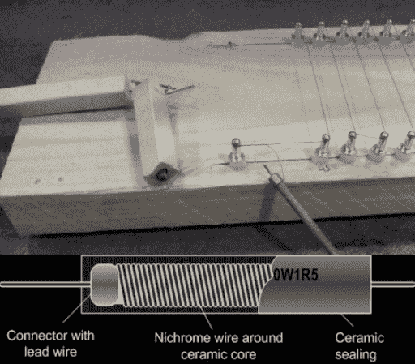

# 从意想不到的来源中回收镍铬合金丝

> 原文：<https://hackaday.com/2014/04/10/recovering-nichrome-wire-from-unexpected-sources/>

当你在紧要关头，所有你喜欢的剩余或电子商店都关门了，你不讨厌吗？你必须完成这个项目，但是怎么做呢？对你们来说，他是一个很好的真正的黑客。[如何从陶瓷加热器中回收镍铬合金丝！](http://electronicmercenary.wordpress.com/2014/04/07/guitar-hero-the-emergency-nichrome-song/)

需求催生了这个想法，因为[Armilar]需要在两片泡沫上切割 45 个切口，以便运送一些长电路板。他不想单独做 90 个切口，就临时制作了这个镍铬合金切片夹具。手边没有一卷镍铬合金，他决定用一种不太传统的方法。他拿出一把大锤，砸开了一个陶瓷线绕电阻器。

据他说，像这种 10W 的漂亮的大陶瓷电阻里面有大约一米长的镍铬合金线！打碎陶瓷后，很容易去除。他用尼龙垫片和铆钉做了一个夹具，然后在整个长度上来回缠绕电线。它工作得很完美——尽管他用的是 240 伏直流电，大约 1.2 安…

如果你不需要如此复杂的设置，总会有我们之前介绍过多次的裸机[钢丝泡沫剪](http://hackaday.com/2014/01/26/diy-foam-cutter-makes-it-too-easy/)。