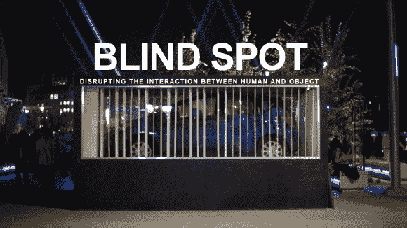

# 用盲点玩躲猫猫

> 原文：<https://hackaday.com/2014/04/12/play-peek-a-boo-with-blind-spot/>

你在音乐会上，一辆装满气球的汽车在一个玻璃盒子里。当你接近盒子时，垂直百叶窗关闭，挡住了你正前方的视线。你向左移动，更多的百叶窗关闭来阻挡你的视线。百叶窗跟随你的一举一动，确保你无法近距离观察车内的情况。你刚刚见到了[盲点，一个由【布伦丹·马特金】创作的互动艺术装置](http://hackaday.io/project/76-BlindSpot)。

盲点出现在 [Breakerhead](http://beakerhead.org/) 上，这是一个令人难以置信的艺术和工程活动，每年九月在加拿大卡尔加里举行。盲点是一辆装在大木箱里的汽车。尽管玻璃后面有 96 个垂直百叶窗，但窗户可以看到盒子内部。垂直百叶窗由业余爱好伺服系统单独控制。伺服系统连接到六个串行伺服控制器，所有这些控制器都由 Arduino 控制。

一台电脑充当盲点的大脑。对于传感器，6 个广角网络摄像头连接到一台标准的 Windows 7 机器。运行 6 个网络摄像头并不完全是标准配置。为了解决这个问题，[Brendan]在 windows 注册表中将网络摄像头换成了友好的名称。网络摄像头图像由[处理](http://www.processing.org/)草图读取。草图扫描图像并决定关闭 96 个百叶窗中的哪一个。盲点代码可在 [github](https://github.com/brendanmatkin/BlindSpot) 上获得。

[https://player.vimeo.com/video/75989734](https://player.vimeo.com/video/75989734)