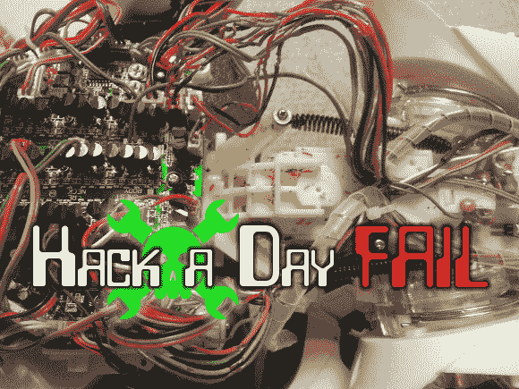

# 本周失败:给机器人重新布线

> 原文：<https://hackaday.com/2014/04/10/fail-of-the-week-rewiring-robosapien/>

我们的第一个想法是“检查所有那些 TO-92 组件！”，但后来我们看到了布线噩梦。[Tom]在一次房产拍卖中以 10 美元的价格买了一个机器人。大多数黑客无法拒绝这个机会，但廉价的收购导致了耗时的修复旅程。当某样东西完全不工作时，你就把它打开看看出了什么问题。迎接他的是绝缘剥落的电线。

这对于任何有能力使用烙铁的人来说都不是问题。因此[Tom]开始着手剪下所有坏线，用在线拼接代替。瞧，小家伙又开始跟着自己的曲调跳舞了！但是成功是短暂的，因为第二天机器人又没有反应了。[Tom]计划在收到他订购的替换连接器后，立即完全更换电线，以完成更多工作。所以你认为，这是一个可以通过导线切除来解决的问题，还是会对主板本身造成实际的损害？

* * *

** 每周失败是一个每周三运行的黑客专栏。通过写下你过去的失败和[给我们发送一个故事的链接](mailto:tips@hackaday.com?Subject=[Fail of the Week])，或者发送你在互联网旅行中发现的失败报道的链接，来帮助保持乐趣。**