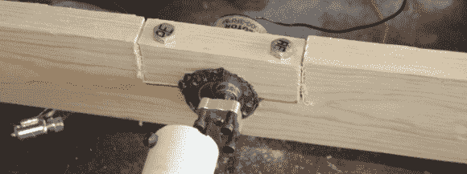
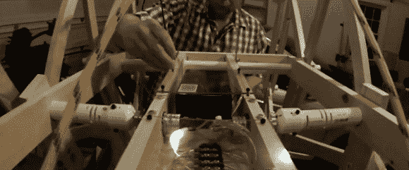

# mountain beest——一只西奥·詹森动物在我的车库里活了过来

> 原文：<https://hackaday.com/2014/04/14/mountainbeest-a-theo-jansen-creature-comes-alive-in-my-garage/>

大约一年前，我家里的一个成员给我发了一个视频，里面有[西奥·詹森的] StrandBeest，他知道我对各种古怪的发明感兴趣。我的第一反应是“哇，这是一个很好的设备，但是那个家伙有点疯狂。”不管是好是坏，这是一个不可思议的发明的想法在我的脑海里转了一段时间。最终，我决定我需要自己建立一个。显然我也有点疯狂。

西奥最初的 beest 依靠风力驱动的复杂联动系统运行。他很好地公布了链接长度或“**11 个神圣数字**”，他在本页底部称他为[。然而，他并没有真正解释他的 PVC 电力传输系统的连接是如何工作的，所以我只能试着从他的视频中找出答案。正如您将从构建细节和随后的视频中看到的那样，这不是小事。继续阅读《跳过这一步》,了解我遇到的逆境，以及最终是如何克服的。](http://www.strandbeest.com/beests_leg.php "Theo Jansen's leg mechanism")

[https://player.vimeo.com/video/71927604](https://player.vimeo.com/video/71927604)

##### 构建开始

出于我不完全确定的原因，我开始用木头而不是 PVC 管制作支腿连杆。也许正是这个[四条腿的微型詹森式步行器](http://www.armure.ch/WALKING.htm "miniature Jansen Mechanism walker")激发了它的灵感。一些联动装置直接从这种设计扩展而来。这也可能是我为什么认为我的 StrandBeest 版本可以用四条腿走路的原因。或者可能是[这个超赞的模拟](http://www.malinc.se/math/geometry/strandbeestsv.php "Interactive Strandbeest simulation")。考虑到做每一条腿需要多少努力，从完成的角度来看，努力越少越好。

一开始，我从来不确定我能跑完多条腿，但是在尝试了第一套联动装置后，正如[HAD] 上看到的[，很快我就在](http://hackaday.com/2013/06/13/building-a-strandbeest/ "testing a single StrandBeest (MountainBeest) leg")[测试两条腿](http://www.jcopro.net/2013/06/27/progress-on-the-mountain-beest/ "2 legs on MountainBeest")。最后，它被固定在四条用 PVC 轴连接在一起的腿上——在[HAD]和下面的视频中也可以看到[。](http://hackaday.com/2014/03/09/building-the-mountainbeest/ "Building the MountainBeest")

[https://www.youtube.com/embed/WwnvAjFfxOs?version=3&rel=1&showsearch=0&showinfo=1&iv_load_policy=1&fs=1&hl=en-US&autohide=2&wmode=transparent](https://www.youtube.com/embed/WwnvAjFfxOs?version=3&rel=1&showsearch=0&showinfo=1&iv_load_policy=1&fs=1&hl=en-US&autohide=2&wmode=transparent)

我认为这很酷，所以构建似乎暂时完成了。我真的把它挂在我的车库里，看看我能不能想出更好的办法来处理它。

##### 完成项目的灵感

几个月后，[杰伊]联系了我，他是哥伦比亚[SC Maker Faire](http://makerfairecolumbiasc.com/ "Maker Faire - Columbia, SC")的招聘人员，想为这个节目做点什么。我的休眠‘beeste’现在被称为‘mountain beeste ’,看起来是一个很好的候选者。[Jay]自告奋勇说他们有绞盘可用(为什么不呢？)来吊起[MountainBeest]上下的蜘蛛。这太棒了，因为我非常怀疑它自己走路的能力。

虽然我可能已经连接了一系列电缆来远程驱动腿，但这似乎还不够好。电子遥控似乎是一个更好的主意，幸运的是，我有一个挡风玻璃刮水器电机和控制装置，是 2012 年[推出的一个失败的“巨型六足机器人”项目遗留下来的。](http://hackaday.com/2012/07/31/a-large-hexapod-made-of-wood-and-pvc-pipe/ "larger than normal hexapod on Hackaday")

##### 构建的一些问题

机械构造很简单，但 PVC 管的电力传输对我来说有些陌生。我的第一个想法是使用自行车的链轮齿轮，我将其转换为单速，并用挡风玻璃刮水器电机为腿提供动力。这个想法有一些潜力，但我是支持传动装置相当糟糕。此外，雨刷马达往往比[MountainBeest]喜欢的速度更快，启动更猛烈。[正如这里看到的](http://www.jcopro.net/2014/03/15/first-attempt-at-motorizing-the-mountainbeest/ "Attempting to motorize the MountainBeest with windshield wiper motor")，即使在升级到更大的单速链后，事情也没有保持在一起。

[https://www.youtube.com/embed/mf25dZ4U-Ws?version=3&rel=1&showsearch=0&showinfo=1&iv_load_policy=1&fs=1&hl=en-US&autohide=2&wmode=transparent](https://www.youtube.com/embed/mf25dZ4U-Ws?version=3&rel=1&showsearch=0&showinfo=1&iv_load_policy=1&fs=1&hl=en-US&autohide=2&wmode=transparent)

然而，我的“定制”单速自行车，用新链条看起来棒极了[。有后备计划是好事。](http://www.jcopro.net/2014/03/22/single-speed-mountain-bike-upgrades/ "Upgrades for my single speed mountain bike")

[MountainBeest]的备用计划是在每组两条腿上使用一个较慢的马达。这将消除任何令人讨厌的链条问题，理论上允许“beest”在行走时转向。这需要一些工作，包括修改框架和提出一个有趣的电机安装解决方案,见下图。然而，它确实起了作用，这也算是在 HaD land 的一次成功。

一个持续的问题是，我一直在使用极低齿轮电机，在机构的行程中的某些点，它往往会在轴上施加巨大的扭矩。为了解决这个问题，我想出了一个聚氯乙烯耦合器，它可以吸收一些震动，并允许它弯曲，就像这里看到的一样。在更传统的设置中，这些被称为“梁”或“螺旋”耦合。我的 PVC 版本在下面的视频中看到。

[https://www.youtube.com/embed/xZzkBMySk94?version=3&rel=1&showsearch=0&showinfo=1&iv_load_policy=1&fs=1&hl=en-US&autohide=2&wmode=transparent](https://www.youtube.com/embed/xZzkBMySk94?version=3&rel=1&showsearch=0&showinfo=1&iv_load_policy=1&fs=1&hl=en-US&autohide=2&wmode=transparent)

##### 完工图纸

在解决(或至少减轻)了我的“步行者”的大部分机械问题后，电子设备变得相当简单。我使用了一个四通道无线电发射机，带有来自 Servocity 的 [PWM 继电器开关。这能够很好地处理 DC 汽车，尽管可能是矫枉过正。在想了想我可以用另外两个通道做什么之后，我想起我已经建立了一个平移/倾斜机制。](http://www.servocity.com/html/electronic_pwm_controlled_dual.html#.U0cmU_m-3Po "PWM Relay switch for RC electronics")

将相机安装到聚碳酸酯外壳上后，只需插入伺服系统即可。只需几个简单的步骤，我就有了一个现成的 GoPro 坐骑，为我的创作增添了视觉效果！

下面是它在车库里完成的视频，这里有更多关于最终版本的信息。不幸的是，实际上让腿行走所需的扭矩对我使用的小马达来说太大了。这将是一个很好的展示，实际上，如果我决定做修订版 1，步行将是一个很好的目标！

[https://www.youtube.com/embed/_yS6Ixjgb_A?version=3&rel=1&showsearch=0&showinfo=1&iv_load_policy=1&fs=1&hl=en-US&autohide=2&wmode=transparent](https://www.youtube.com/embed/_yS6Ixjgb_A?version=3&rel=1&showsearch=0&showinfo=1&iv_load_policy=1&fs=1&hl=en-US&autohide=2&wmode=transparent)

所以有时候一个人只需要一点点推动就能真正完成一个项目！希望我的[MountainBeest]能在今年南卡罗来纳州哥伦比亚的制造商博览会上有好的表现。我当然很期待。如果你今年 6 月 14 日碰巧在这个地区，或者想去旅行，一定要过来打个招呼！

完全披露:我已经收到了与这篇文章无关的这个项目中使用的一些部件的促销考虑。

* * *

Jeremy Cook 是一名全职工作 10 年的制造工程师，拥有克莱姆森大学的 BSME。工作之外，他是一个狂热的制造者和实验者，从事各种工作，从业余爱好数控机械，到灯光涂鸦，甚至偶尔 DIY 乐器。当他不忙着创造(或破坏)什么的时候，他会为他的博客[JcoPro.net](http://www.jcopro.net/ "JcoPro.net - Jeremy Cook's Projects")和[DIYTripods.com](http://diytripods.com/ "DIYTripods - creative ways to mount and use your camera")写东西。