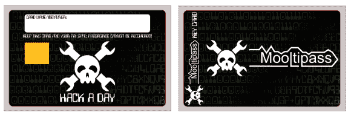

# 开发于 Hackaday:还有 2 天提交您的设计！

> 原文：<https://hackaday.com/2014/04/10/developed-on-hackaday-2-days-left-to-submit-your-design/>

我们确信许多 Hackaday 的读者已经知道, [Mooltipass 项目](http://github.com/limpkin/mooltipass)的两个主要组件之一是智能卡，其中包含 AES-256 加密密钥。两周前[我们问](http://hackaday.com/2014/03/27/developed-on-hackaday-need-card-art-who-likes-to-draw/)你是否有兴趣想出一个将被印在最终卡片上的设计。像往常一样，许多人渴望做出贡献，最近给我们发来了[几条建议](https://github.com/limpkin/mooltipass/tree/master/smartcard_designs)。如果您错过了电话，并想加入进来，现在还不算太晚！在周日之前，您仍可以在 mathieu[at]hackaday[dot]com 上发送 CMYK 矢量图像。更多详细规格可在[这里](https://github.com/limpkin/mooltipass/blob/master/smartcard_designs/Mooltipass-smartcard-template-V2.png)找到。

几天后，我们还将在 Hackaday 上发布项目更新，因为我们最近收到了奥利维尔设计的顶部和底部 PCB。低级库将很快完成，希望几天后我们能够向开发者和测试者提供一些设备。我们也仍然在寻找可能有兴趣帮助我们开发浏览器插件的贡献者。

Mooltipass 团队还要感谢我们亲爱的读者，他们给了我们关于[黑客日项目](http://hackaday.io/project/86-Mooltipass)的灵感！