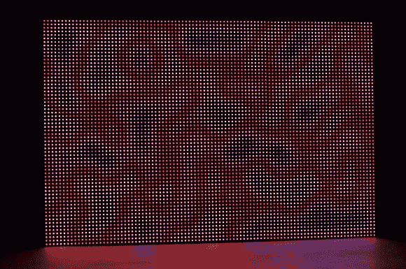

# BeagleBone 黑色和 FPGA 驱动的 LED 墙

> 原文：<https://hackaday.com/2014/04/11/beaglebone-black-and-fpga-driven-led-wall/>

这是由 BeagleBone Black 和 FPGA 控制的 6144 个 RGB LEDs。这为显示器提供了 12 位颜色和 200 Hz 的刷新率。【Glen】的 [6 面板 LED 墙](http://bikerglen.com/blog/expanding-the-beaglebone-black-and-fpga-to-drive-6-or-more-panels/)使用 BeagleBone Black 生成图像， [LogiBone FPGA 板](http://valentfx.com/fpga-logi-family/logi-bone)用于高速 IO。

[Glen]从一个 32 x 32 RGB LED 面板开始，[写了一个详细的教程](http://bikerglen.com/projects/lighting/led-panel-1up/)介绍这个建筑是如何工作的。用于这个项目的 LED 面板有内置驱动器，但它们不能进行 PWM。为了控制颜色，整个面板必须高速更新。

BeagleBone 的 IO 不够快，因此 Xilinx Spartan 6 LX9 FPGA 负责高速信号传输。图像由 BeagleBone 加载到 FPGA 的块 RAM 中，剩下的由 FPGA 处理。LogiBone 将 FPGA 的地址空间映射到 CPU 的地址空间，从而实现高速传输。

如果你想驱动这么多的 led，你需要超越 Arduino。[Glen]的工作提供了一个很好的起点，所有的源代码都可以在[Github](https://github.com/bikerglen/beagle/tree/master/projects/led-panel-6up)上找到。

[感谢乔纳森的提示]