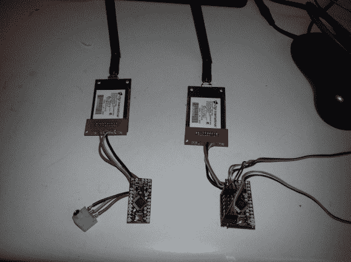

# 伸出手，用远程遥控控制器触摸你的下一个项目

> 原文：<https://hackaday.com/2014/04/11/reach-out-and-touch-your-next-project-with-long-range-rc-controller/>

项目的远程无线控制始终是一个挑战。[Mike]和他的团队希望为一个无人机项目扩展他们当前的 RC 设置的范围，并决定用一对 Arduino mini 和有点贵的[Digi Xtend 900 MHz 调制解调器](https://www.sparkfun.com/products/9411)来完成这个任务。1 瓦收发器的覆盖范围为 40 英里，提供了极佳的覆盖范围。再加上大家都很熟悉的 Arduino，你就有了一个简单的长距离链接。

[Mike]设置发射器，使其可以直接插入任何 RC 控制器训练端口，解码输入信号并将其转换为串行数据包进行传输。虽然它们不提供我们见过的其他射频发射器的范围，但调制解调器的 40 英里范围对大多数项目来说都绰绰有余，包括 T2 高空气球任务。

Arduino 发射器和接收器端的代码[可从其 github](https://github.com/mswillia/rxtx) 获得。尽管代码中没有内置的错误纠正功能，但他们没有遇到任何问题。不幸的是，没有提供原理图，但您应该能够从图像和数据手册中获得足够的信息来构建一个工作链路。