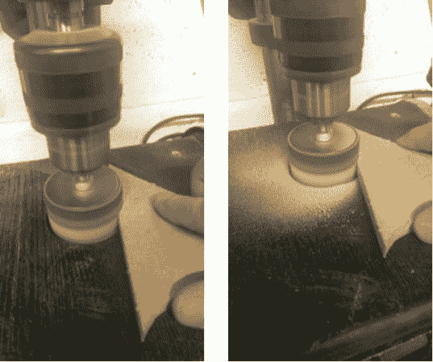

# 把你的钻床变成线轴/主轴砂光机

> 原文：<https://hackaday.com/2014/04/12/turn-your-drill-press-into-a-bobbinspindle-sander/>

钻床是典型汽车修理厂的主要工具——它们不太贵，而且不可或缺地有用——但是你有没有想过把它变成一个主轴砂光机？

你可以买到相当便宜的鼓式打磨机套件，但问题是它们真的很难使用，而且真的很脏——你很快就会发现到处都是锯屑。卡尔在这里做的是为他的钻床制作一个木箱，每个鼓式砂光机钻头都有不同尺寸的孔。通过在盒子上安装一个真空吸尘器，你可以在工作的同时清理你的垃圾。

请注意，钻床不像磨机那样可以承受径向载荷。如果你打算做一些非常沉重的打磨，增加一个螺栓穿过整个鼓式打磨机钻头，然后将其与盒子内的固定轴承耦合可能是一个好主意。

这是一个非常简单的方法，但是可以为你节省一个额外的电动工具，和你工作台上的空间！有电钻但没有钻床？[没问题](http://hackaday.com/2010/11/29/drill-press-for-through-hole-pcb-manufacturing/)。