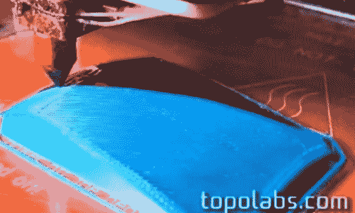

# 三维打印，这次是真的

> 原文：<https://hackaday.com/2014/04/13/printing-in-three-dimensions-for-real-this-time/>

3D 打印机不会连续打印三维图像——它们打印一层，然后是另一层，然后是另一层。对于每一项 3D 打印技术来说都是如此，但现在 [Topolabs 有一项非常有趣的技术](http://www.topolabs.com/)改变了这一点。他们通过在 Z 轴上移动进行三维打印，同时也在 X 轴和 Y 轴上打印。

Topolabs 软件背后的基本思想是打印一个支持块，然后在支持块上打印一个对象。支撑块可以是弯曲的和凸起的，并且成品遵循固体支撑块的轮廓。与“带支架打印”不同，打印机沿 X、Y 和 Z 轴挤压，这将使成品更加坚固。

这种技术有几个缺点——必须在支撑块的顶部涂上脱模剂。在下面的视频中，Topolabs 使用的是 Kapton，但发胶或胶棒也可以。打印机可以打印的倾斜度也有限制，这取决于挤出机喷嘴的尺寸。最后，这种技术更适合 delta 风格的机器人，但是团队使用普通的笛卡尔机器人得到了非常好的结果。

你可以在下面看到一些 Topolabs 打印技术的视频。

[https://www.youtube.com/embed/556VmPXWfTg?version=3&rel=1&showsearch=0&showinfo=1&iv_load_policy=1&fs=1&hl=en-US&autohide=2&wmode=transparent](https://www.youtube.com/embed/556VmPXWfTg?version=3&rel=1&showsearch=0&showinfo=1&iv_load_policy=1&fs=1&hl=en-US&autohide=2&wmode=transparent)

[https://www.youtube.com/embed/Qkwkk1S-_Ek?version=3&rel=1&showsearch=0&showinfo=1&iv_load_policy=1&fs=1&hl=en-US&autohide=2&wmode=transparent](https://www.youtube.com/embed/Qkwkk1S-_Ek?version=3&rel=1&showsearch=0&showinfo=1&iv_load_policy=1&fs=1&hl=en-US&autohide=2&wmode=transparent)