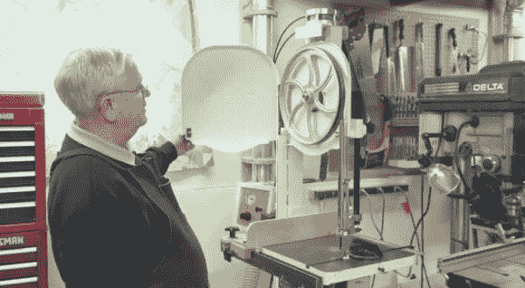

# 气动带锯简化了木工生活

> 原文：<https://hackaday.com/2014/04/13/air-tensioned-bandsaw-simplifies-woodworking-life/>

如果你曾有幸拥有一把带锯，你就会知道尝试更换锯条或适当拉紧锯条是多么有趣。[Richard T]对此感到厌倦，决定用一点气动来升级他的带锯。

要取下带锯锯条或拉紧锯条，你必须转动带锯顶部的调节旋钮——这有点笨拙，真的很烦人。[理查德]已经取出了丝杠，并用气压缸取而代之。他增加了一个带有主阀和压力调节器的控制面板。为了移除带锯条，他用阀门给系统放气，为了拉紧它，他打开调节器！很简单，超级有效。

这对于张紧特别方便，因为在轻轻转动调节器的同时，您可以在[“颤振测试”](https://www.youtube.com/watch?v=z8zZuDosSy0)期间观察叶片。

如果你找对了地方，你可能会花不到 50 美元就能建造一个这样的系统。关于完整的解释，请留下来听听[理查德]本人的解释！

[https://www.youtube.com/embed/oDCTa16aHh0?version=3&rel=1&showsearch=0&showinfo=1&iv_load_policy=1&fs=1&hl=en-US&autohide=2&wmode=transparent](https://www.youtube.com/embed/oDCTa16aHh0?version=3&rel=1&showsearch=0&showinfo=1&iv_load_policy=1&fs=1&hl=en-US&autohide=2&wmode=transparent)