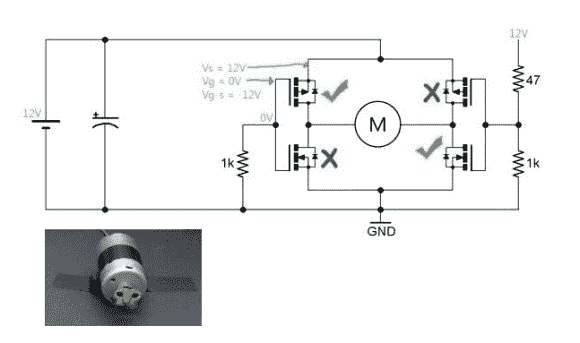

# 一个 H 桥电机控制器教程让它简单易懂

> 原文：<https://hackaday.com/2014/04/25/a-h-bridge-motor-controller-tutorial-makes-it-simple-to-understand/>

[Afroninja]带来了另一个关于基础电子学的很棒的教程。这一次，他解释了 H 桥电机控制器及其工作原理。

即使你没有太多(或任何)基本电路的经验，[Afroninja]也以清晰、简洁和易于理解的方式解释了 H 桥电机控制器的概念。那么什么是 H 桥呢？对于任何使用 DC 电机的项目，如果你想让电机在任一方向上旋转，你需要一种方法来为两种不同配置的电机提供动力，也就是说，你必须以某种方式交换极性。

最简单的方法是使用 H 桥。它被称为 H 桥…因为它的形状像一个 H，马达在正中间。它允许两个极性来控制电机——然而，如果你只是用普通的旧开关或继电器来控制，如果你试图同时向两个方向走，你可能会短路！为了解决这个问题，[Afroninja]解释了如何通过使用晶体管(如果你试图滥用电路，晶体管会降低电压)来防错电路。

这是一个 5 分钟的视频，非常值得一看——休息后留下来了解更多信息！

[https://www.youtube.com/embed/iYafyPZ15g8?version=3&rel=1&showsearch=0&showinfo=1&iv_load_policy=1&fs=1&hl=en-US&autohide=2&wmode=transparent](https://www.youtube.com/embed/iYafyPZ15g8?version=3&rel=1&showsearch=0&showinfo=1&iv_load_policy=1&fs=1&hl=en-US&autohide=2&wmode=transparent)

他还制作了一系列关于电感的视频教程！