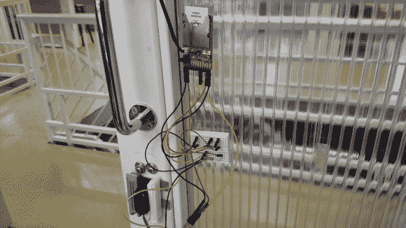

# 电动 Imp 自动锁闭和开启你的门

> 原文：<https://hackaday.com/2014/04/14/electric-imp-locks-and-unlocks-your-door-automatically/>

当 PinMeTo 的员工搬进新办公室时，他们沮丧地发现多一把钥匙要花掉他们 500 瑞典克朗(约 75 美元)。相反，他们决定使用电动 Imp 系统制造自己的[自动门锁。](http://www.slickstreamer.info/2013/12/electric-imp-automatic-door-look.html)

如果你不熟悉，Electric Imp 是一种小型 SD 卡，旨在为消费设备提供互联网(Wi-Fi)功能。虽然它看起来像一个 SD 卡，但你不能只把它插入任何 SD 卡插槽就指望它工作——它仍然需要一个[原型板。](http://www.adafruit.com/products/1130)我们已经看到它被用来制作[无线热敏打印机](http://hackaday.com/2014/01/25/electric-imp-thermal-printer/)，甚至制作[推特猫门](http://hackaday.com/2013/01/04/electric-imp-makes-a-cat-door-tweet-its-activities/)让你知道任何猫入侵者！

总之，回到黑客的话题。为了移动锁芯，他们使用了一个直接连接到 Imp 的基本 RC 伺服系统。一个弯曲传感器安装在锁上方的门的侧面，这为 Imp 提供了门是否实际上锁的反馈。然后，Imp 与每个遥控器进行通信，以允许从您的手机上使用键盘。

它可能比一把新钥匙花费更多的时间和金钱，但是，嘿，它看起来像是一个有趣的项目！