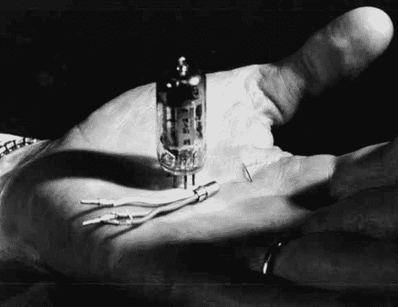

# 逆向技术:低温电子计算机

> 原文：<https://hackaday.com/2014/04/15/retrotechtacular-the-cryotron-computer/>

你以前听说过低温电子计算机吗？当然不是。硅杀死了无线电之星:这是一个过去技术竞争的故事。上面的手握着两个竞争对手，最笨重的显然是真空管，三条腿的设备是什么成为家喻户晓的名字。但是在那根管子的右边是另一个技术奇迹，它也可以被结合到计算机中:低温管。

[Dudley Allen Buck]和他对早期计算的贡献是一个可能的替代宇宙的故事，即[可能是低温管而不是硅晶体管](http://spectrum.ieee.org/computing/hardware/dudley-bucks-forgotten-cryotron-computer)。早期我们发现理论指向奇异的超导材料，但我们高兴地发现在概念和测试阶段[巴克]是黑客。他用不同的金属制作了第一个实验性的电子开关，并将它们浸泡在液氦中。这些装置是包在钽丝上的铜线。钽是电路路径，铜线通过改变钽电阻的磁场充当开关。

这个名字来自于使开关正常工作所必需的低温槽。小型化是关键，一如既往；上面的例子是一个相对较小的线绕低温管的例子，但最终目标是一个我们今天非常熟悉的过程。[Buck]正在寻找薄膜制造技术，这种技术可以让他将 75，000 个或更多的鞋号集成到一个计算平台中。猜猜谁在他职业生涯的这个时期来敲他的门？国家安全局。故事从此变得更加有趣，但为了避免我们重写这篇文章，我们留给你这个:这项技术最终可能会击败硅。目前，它是那些奔向量子计算终点线的公司中最酷的孩子之一。

[谢谢弗雷德里克]

Retrotechtacular 是一个每周专栏，以旧时的黑客、技术和媚俗为特色。通过[发送您对未来分期付款的想法](mailto:tips@hackaday.com?Subject=[Retrotechtacular])，帮助保持新鲜感。