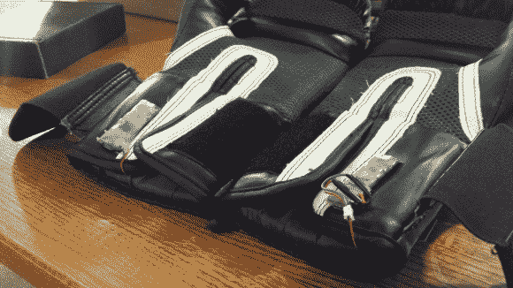

# 和蔻驰一起步入拳击台

> 原文：<https://hackaday.com/2014/04/15/step-into-the-ring-with-fight-coach/>

随着 MMA 越来越受欢迎，竞争也越来越激烈。总有一些人比你训练得更努力，时间更长。那么，你如何获得超越竞争对手的优势呢？更多俯卧撑？仰卧起坐？多吃蔬菜？在你的每只手套上安装定制的 2×1 英寸、5 克 PCB，配备 ATmega32U4、MPU-6050 6 轴加速度计和 RN-41 蓝牙模块怎么样？这就是我们正在谈论的。

康奈尔大学的[Vincent]和[Jooyoung]和他们的同学一起制作了另一个很酷的电子工程作品。[战斗蔻驰](http://people.ece.cornell.edu/land/courses/ece4760/FinalProjects/f2013/vtn6_jp629/vtn6_jp629/home.html)记录拳手手套中的数据，这样不仅可以对其进行分析以提高性能，还可以与拳手进行实时互动。虽然不像我们已经看到的一些[战斗机训练技术](http://hackaday.com/2010/10/17/live-action-fighting-games/)那样令人身临其境，但《蔻驰之战》可能只是让一名战斗机在擂台上有一点优势。

战斗蔻驰提供 3 种训练模式:防御模式，伤害模式和自由训练模式。像往常一样，康奈尔大学的项目，所有的代码，图表和丰富的项目信息只是点击一下。休息之后留下来观看蔻驰格斗的视频演示。

[https://www.youtube.com/embed/0hn7gKBAS2c?version=3&rel=1&showsearch=0&showinfo=1&iv_load_policy=1&fs=1&hl=en-US&autohide=2&wmode=transparent](https://www.youtube.com/embed/0hn7gKBAS2c?version=3&rel=1&showsearch=0&showinfo=1&iv_load_policy=1&fs=1&hl=en-US&autohide=2&wmode=transparent)