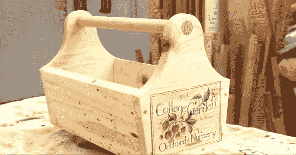

# 喷墨转移到木材上

> 原文：<https://hackaday.com/2014/04/16/inkjet-transfers-to-wood/>

你不能用普通喷墨打印机打印一块木头，即使你可以，这种材料的性质也很可能导致打印效果不佳。但是[史蒂夫·拉姆齐]在他的 YouTube 频道上有一个关于喷墨转移木材的教程，这是一个简单的两步方法，可以产生很好的效果。我们真的很喜欢这样的快速提示。史蒂夫解释了整个技术，同时创建了一个示例项目-所有不到 2 分钟的视频。不过，我们不想让你抱太大希望——这种方法只适用于多孔的吸水表面，如裸木，而不适用于 PC 板。虽然过去我们在这里介绍过一些很棒的[注入 PCB 抗](http://hackaday.com/2013/11/02/perfect-pcbs-with-an-inkjet-printer/) 方法。

转移技术非常简单。[Steve]使用一张用过的喷墨标签的背面(通常会被扔掉的有光泽的部分)。他用喷墨打印机打印底纸。因为涂有塑料的背板没有孔，所以墨水不会渗入并变干。然后，他把仍然潮湿的纸压在一块木头上。潮湿的墨水立即被木头吸收。漆透明涂层密封图像，真正使颜色流行。我们希望看到这种方法如何应用于其他多孔材料，如织物(尽管这种墨水可能无法在洗衣机中存活)。

点击休息时间观看[Steve]工作的另一个例子，以及两个介绍该技术的视频。

[https://www.youtube.com/embed/Zq2O66QGCwg?version=3&rel=1&showsearch=0&showinfo=1&iv_load_policy=1&fs=1&hl=en-US&autohide=2&wmode=transparent](https://www.youtube.com/embed/Zq2O66QGCwg?version=3&rel=1&showsearch=0&showinfo=1&iv_load_policy=1&fs=1&hl=en-US&autohide=2&wmode=transparent)

[https://www.youtube.com/embed/bdo64-wo63Q?version=3&rel=1&showsearch=0&showinfo=1&iv_load_policy=1&fs=1&hl=en-US&autohide=2&wmode=transparent](https://www.youtube.com/embed/bdo64-wo63Q?version=3&rel=1&showsearch=0&showinfo=1&iv_load_policy=1&fs=1&hl=en-US&autohide=2&wmode=transparent)