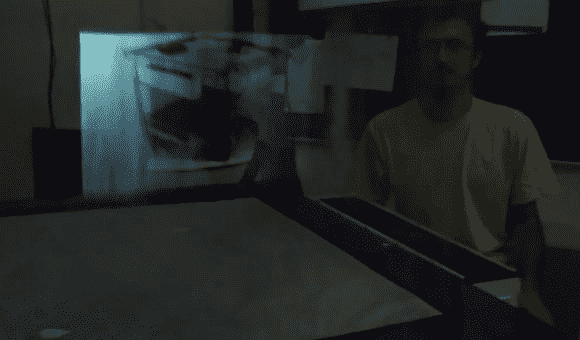
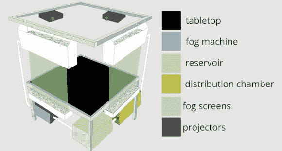

# 交互式 3D 投影充其量是模糊的

> 原文：<https://hackaday.com/2014/04/17/interactive-3d-projection-is-foggy-at-best/>

手边有投影仪和烟雾机吗？你可能想试试这个雾投影的东西！它被称为 [MisTable，是一个交互式操作图像的三维游戏场。](http://www.livescience.com/44750-3d-fog-displays-could-be-screens-of-the-future-video.html)

这是布里斯托尔大学的布里斯托尔互动和图形小组的一个项目，这是 3D 投影的一个有趣的转折。他们已经创造了他们所谓的 MisTable，它有一个烟雾机，“烟幕”和三个投影仪。结果是一张两人互动的桌子。桌面是一个显示器，就像每个人面前的透视雾一样(“雾屏”)。

虽然它很容易理解和解释，但在下面的休息之后有一个方便的图表显示该系统是如何工作的。我们的问题是，你们中的一个人打算什么时候试着做一个？

对于一个更清晰的全息投影，总有玻璃像在[佩珀的幽灵幻觉！](http://hackaday.com/2013/10/06/peppers-ghost-halloween-ghosting/)但是我们必须承认，能够透过屏幕看到错误也是一件很棒的事情。

【谢谢道格拉斯！]