# 在 FTF2014 上构建物联网

> 原文：<https://hackaday.com/2014/04/16/building-the-internet-of-thing-at-ftf2014/>

[https://www.youtube.com/embed/vGslqSaq5w4?version=3&rel=1&showsearch=0&showinfo=1&iv_load_policy=1&fs=1&hl=en-US&autohide=2&wmode=transparent](https://www.youtube.com/embed/vGslqSaq5w4?version=3&rel=1&showsearch=0&showinfo=1&iv_load_policy=1&fs=1&hl=en-US&autohide=2&wmode=transparent)

这是官方消息:围绕物联网的所有炒作开始变得有点烦人。这并不是因为构建互联网连接设备有什么错，而是因为许多人正试图带着同样古老的“未来:由 Megacorp #07 带给你”的心态加入这股潮流。被疏远的专业人士的循环愿景，他们的家、办公室、商务会议和酒店房间，都由最新的“一个物联网平台统治他们所有人”驱动——又回来了。即使神话中的“智能”冰箱没有在 2001 年改变世界，我想再试一次也没有坏处。毕竟，我们已经看到这在软件领域取得了巨大的成功，十年后，网络时代想法的重做变成了巨大的成功。
 [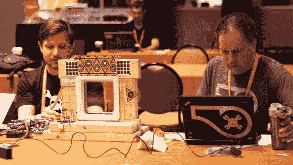](https://hackaday.com/wp-content/uploads/2014/04/5545721397452204787.png) 一切都很好，我们祝每个人好运，但未来我们最大的粉丝是一个可黑客攻击的、社区构建的、开放硬件的。因此，当来自 [FTF2014](http://www.freescale.com/webapp/sps/site/overview.jsp?code=FTF_AMERICAS_HOME "FTF2014") 的家伙们打电话给我们，让我们主持一个为期两天的“实验室”，工程师们可以在实验室里四处玩耍，尝试开发一个有趣的物联网产品，我们非常乐意加入进来，并尝试按照我们的方式来做。我们让大约 24 名工程师放弃讲座和培训课程，和我们一起呆在实验室里。我们让飞思卡尔分发了一大堆 FRDM-K64F 板，还有几个 mbed.org 的人现场加入我们，帮助开发工具。两天后，我们有了我们的获胜者——由 [David Isbister](https://twitter.com/djisf "David Isbister") 和 [Ernie Aguilar](https://twitter.com/ErnieInHD "Ernie Aguilar") 创作的《不要不要进入》。他们做了一件了不起的工作，不仅是破解了一个伟大的产品(精心制作的互联网连接的猫翻板门)，更重要的是，修复了我们手头的硬件/固件/工具堆栈中的一大堆问题。 [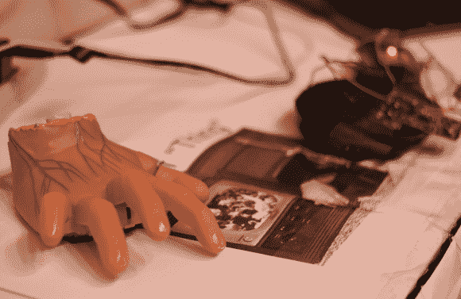](https://hackaday.com/wp-content/uploads/2014/04/9743731397452324062.png) 然而，从整个活动中走出来的一项真正颠覆性的技术，是我们的二等奖获得者——[伊莱·休斯](https://twitter.com/emh203 "Eli Hughes")，他的项目叫:物联网。你猜对了——这是*亚当斯家族*的[东西](http://en.wikipedia.org/wiki/Thing_(The_Addams_Family) "Thing")！在这个颠覆性的俏皮聪明的终极展示中，Eli 不仅仅创造了一个有趣的项目。他号召一大群沉默寡言的“专业”工程师开始思考 RFID 和显而易见的智能设备之外的问题，并试图在他们的工作中带回一点古怪的黑客精神。Eli 的项目在实现方面也非常有趣。他在 [Fantasma Toys Hand Runner](http://www.newegg.com/Product/Product.aspx?Item=9SIA0190BB9057 "Fantasma Toys Hand Runner") 上做了一些聪明的手术来提高功率，并创建了一个电路来连接东西的内置红外遥控器和 WiFi。他还建立了一个很酷的命令行界面和一个触摸屏应用程序，通过运行在带有 RX-XV 模块的 K64 板上的 TCP 服务器与事物进行通信。这种设置可以带来无尽的乐趣，无论是通过触摸界面控制，还是更重要的是，通过使用 DSL 外壳编写其运动脚本。要了解更多细节，请访问 hackaday.io 查看他的[项目条目。希望这个项目能给我们所有人一个很好的提醒，那就是未来不仅仅是一个“第二人生的现实主义版本”，如果我们要建造定义它的项目，我们将不得不更加努力，拿出一些真正有创造性和原创性的想法。确保我们一路上玩得开心。](http://hackaday.io/project/778-Internet-of-%22Thing%22 "project entry at hackaday.io")

  Coding signal filtering for motion detection algos [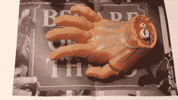](https://hackaday.com/2014/04/16/building-the-internet-of-thing-at-ftf2014/img_1130/) The “Thing” [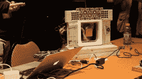](https://hackaday.com/2014/04/16/building-the-internet-of-thing-at-ftf2014/img_1119/) Don’t not enter  Hacking in the shadow of the skull [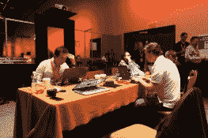](https://hackaday.com/2014/04/16/building-the-internet-of-thing-at-ftf2014/img_1101/) Problems with freshly baked boards [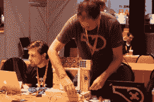](https://hackaday.com/2014/04/16/building-the-internet-of-thing-at-ftf2014/img_1049/) Wood glue in action  Thing : Full stack  Fixing mbed/ethernet stack  Fixing mbed/ethernet stack – some more [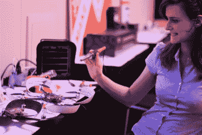](https://hackaday.com/2014/04/16/building-the-internet-of-thing-at-ftf2014/img_0998/) Quadcopter repair take #1 [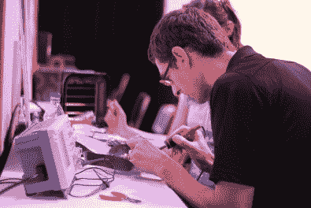](https://hackaday.com/2014/04/16/building-the-internet-of-thing-at-ftf2014/img_0991/) Quadcopter repair take #2 [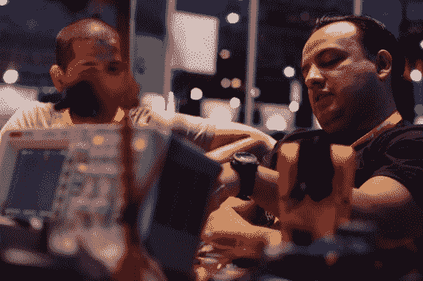](https://hackaday.com/2014/04/16/building-the-internet-of-thing-at-ftf2014/img_0968/) Node.js/ttyS workarounds [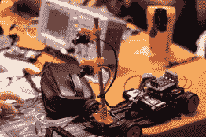](https://hackaday.com/2014/04/16/building-the-internet-of-thing-at-ftf2014/img_0967/) More things & pieces [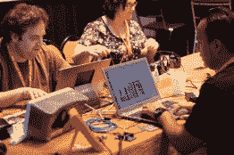](https://hackaday.com/2014/04/16/building-the-internet-of-thing-at-ftf2014/img_0964/) The “Thing” Consortium [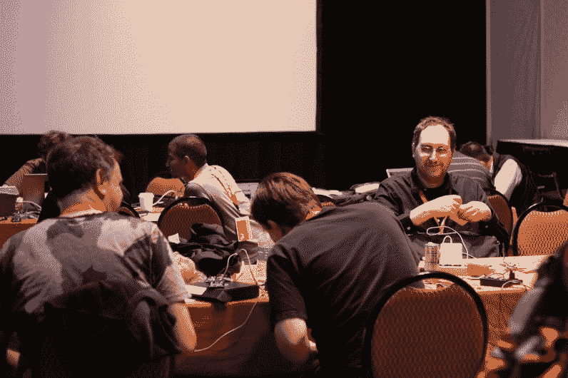](https://hackaday.com/2014/04/16/building-the-internet-of-thing-at-ftf2014/img_0960/) hacking away…