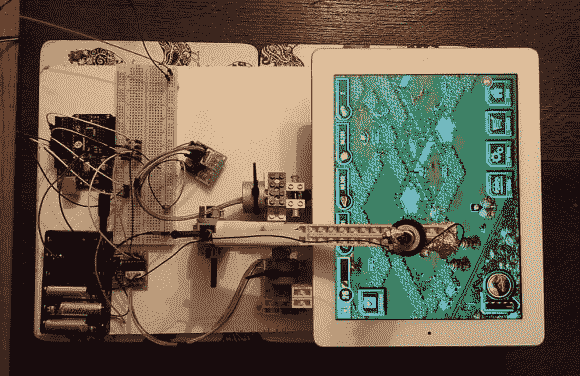

# 乐高机器人在你睡觉的时候为你玩游戏

> 原文：<https://hackaday.com/2014/04/17/lego-robot-plays-games-for-you-as-you-sleep/>

因在 2011 年伦敦马拉松比赛中解决 100 个魔方而闻名的乌里·基利安沉迷于一款名为《侏罗纪公园建造者》的免费 iPad 游戏。作为一个有效率的人，他很快意识到这个游戏可以自动化——毕竟，你只需要每隔几分钟点击恐龙来赚取游戏货币…

他正在用一个旧 iPad 和一个连接到 Windows 笔记本电脑的 Arduino 来组装乐高技术。机器人玩游戏时，轮子会前后滚动 iPad。机器人的“手指”用锡纸包裹，并连接到一个接地引脚，以模拟 iPad 的人类手指。这篇文章没有解释它是如何工作的，但通过观察机器人，它似乎只是随机地在屏幕上来回敲击——我们猜测这对于这个游戏来说是可行的？

他从 8 岁起就不再玩乐高了，只是在做这个之前几周才知道 Arduino。作为一名 3D 艺术家，他很想在现实世界中做点什么——真好！

【感谢奥雷里奥和威廉！]