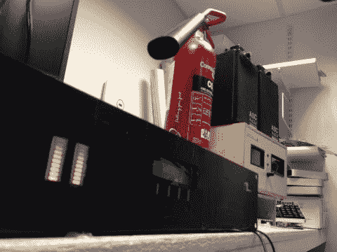

# Raspberry Pi 远程音频链接

> 原文：<https://hackaday.com/2014/04/17/raspberry-pi-remote-audio-link/>

在广播领域，许多人仍在使用专用模拟线路连接远程站点。这些电话就像老式的电话系统:你给接线员打电话，要求接通一个特定的站点。它们也相当贵。

对于一家医院广播电台，[Marc]希望用成本更低的系统取代旧系统。结果就是他的[树莓 Pi STL in a Box](http://dlineradio.co.uk/articles/raspberry-pi-stl-box) 。盒子里面是一个树莓派、 [PiFace](http://www.piface.org.uk/) 显示器、一对仪表和一些音频模拟硬件。

在软件方面，系统使用 [LiquidSoap](http://savonet.sourceforge.net/index.html) 来管理流。LiquidSoap 使用一种语言来配置流，【Marc】有一篇关于[如何为这个应用配置 LiquidSoap](http://dlineradio.co.uk/articles/stls-and-raspberry-pis) 的文章。在硬件方面，SSM2142 ICs 将信号从单端转换为平衡信号。电表使用 LM3915 条形驱动器来控制电表。

提供了控制盒子的 Python 脚本，对于任何需要构建自己的低成本音频链接的人都有帮助。