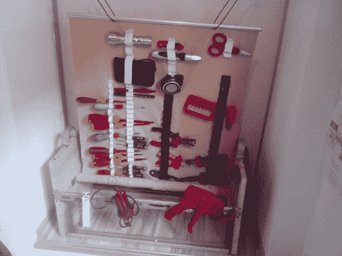

# 自动卷收工具储存

> 原文：<https://hackaday.com/2014/04/18/auto-roll-up-tool-storage/>

[安瑞德的]得到了正确的想法。每个人和他们的母亲都有一个工具箱:长方形的、木制的、拥挤的。你那老东西没给任何人留下深刻印象。取而代之的是，为什么不把它卷起来，用一个旋转的工具箱来存放呢？

这种储物方式似乎从[野战医疗包](https://www.youtube.com/watch?v=M1rrS21FCOo#t=226)中获得了灵感，所有东西都摆放在那里，只需快速一扔就能轻松取用。[Anred]首先列出了他想要定期使用的所有物品的清单，用结实的布料将它们组织起来。接下来，他标记了所有的安装点，并用针和线固定了一些弹性材料来固定每个工具。然后，工具会围绕中心杆卷起，就像一个上下颠倒的窗帘。

老实说，我们不完全确定[Anred]是如何操纵中心杆滚动的，但它似乎是弹簧驱动的。也许我们有眼光的读者可以解决这个问题，并在评论中给我们提示。然而，我们最喜欢的功能是拉出杆的巧妙使用。要展开工具，你抓住上面的杆并拉紧，把它固定在上面的什么东西上。然而，当你把它放下来收拢纸卷时，顶杆可以放在两个支架下面，为搬运整个组件提供了一个方便的把手。看看下面的视频。

[https://www.youtube.com/embed/xO1Rk41kIes?version=3&rel=1&showsearch=0&showinfo=1&iv_load_policy=1&fs=1&hl=en-US&autohide=2&wmode=transparent](https://www.youtube.com/embed/xO1Rk41kIes?version=3&rel=1&showsearch=0&showinfo=1&iv_load_policy=1&fs=1&hl=en-US&autohide=2&wmode=transparent)

[https://www.youtube.com/embed/ZKUByzrSSvU?version=3&rel=1&showsearch=0&showinfo=1&iv_load_policy=1&fs=1&hl=en-US&autohide=2&wmode=transparent](https://www.youtube.com/embed/ZKUByzrSSvU?version=3&rel=1&showsearch=0&showinfo=1&iv_load_policy=1&fs=1&hl=en-US&autohide=2&wmode=transparent)

[https://www.youtube.com/embed/p3LMkch62tE?version=3&rel=1&showsearch=0&showinfo=1&iv_load_policy=1&fs=1&hl=en-US&autohide=2&wmode=transparent](https://www.youtube.com/embed/p3LMkch62tE?version=3&rel=1&showsearch=0&showinfo=1&iv_load_policy=1&fs=1&hl=en-US&autohide=2&wmode=transparent)