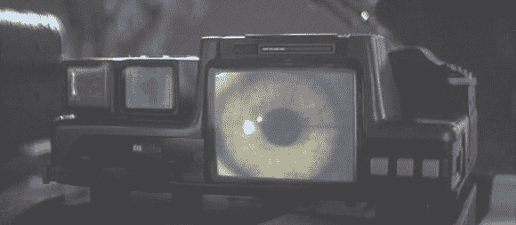

# 科幻竞赛综述:沃伊特-坎普夫机器

> 原文：<https://hackaday.com/2014/04/19/sci-fi-contest-roundup-the-voight-kampff-machine/>

> 你正在观看一场舞台剧——一场宴会正在进行。客人们正在享用生蚝开胃菜。主菜包括煮狗肉和米饭。生蚝比一盘水煮狗肉更不容易被你接受。

来自*银翼杀手*的 Voight-Kampff 机器，或称 VK，是一种极其先进的测谎仪，它根据脸红反应、瞳孔放大、呼吸、心率和其他生理因素对情绪激动的问题做出反应，以确定审讯对象是否会梦到电子羊。这也是一个很棒的道具，让它成为了[我们的科幻竞赛](http://hackaday.io/page/276)的一个很好的主题。

> 你有一个小男孩。他给你看他的蝴蝶收藏和杀人罐。你是做什么的？

[Aven] [正在建造一台 Voight-Kampff 机器](http://hackaday.io/project/547-Voight-Kampff-Machine-(Blade-Runner))围绕着一个树莓 Pi 建造，用几个小液晶显示器显示模拟的生命体征。当然，会有一个小的网络摄像头显示被摄对象的脸或眼睛，还有几个发光二极管，会以与原始图像相同的模式闪烁。

> 你正在看一本杂志。你看到一整版的女孩裸照。

[Aven]要完成 VK 还有一点工作要做，但是比赛还有一周半的时间。你有足够的时间来想出你自己的科幻项目，用你的脏手去拿一些非常棒的奖品。