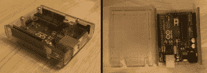
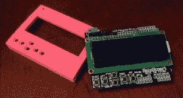
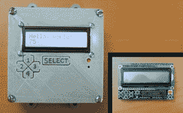
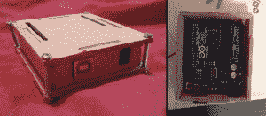
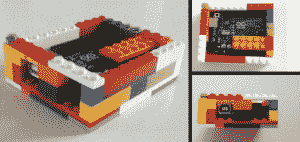
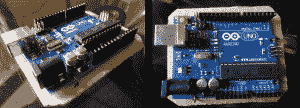

# 你从来不知道的 DIY Arduino 案例

> 原文：<https://hackaday.com/2014/05/09/diy-arduino-cases-you-never-knew-existed/>

确实有很多种类的 Arduinos，但是在 Arduino 的情况下，种类可能会更多。让我们以最流行的 Arduino 外形为例，Uno。以下是 Uno 规模董事会的一些独特案例。

由【mega duty】[Arduino 保护盒](http://www.instructables.com/id/Arduino-Protection-Box/?lang=es) 

我们称之为健壮。虽然它是 3D 打印的，但它的目的是非常保护居民。一些额外的想法进入这种情况下，没有工具是必要的！Arduino 卡入到位后，盖子也会卡入到位。有一个通道门可以把输入/输出线接到自由世界。[Megaduty]表示，这包含 0.1 美元的塑料。不错的交易。

由【杰森】[勒桑美](http://www.instructables.com/id/Clear-polycarbonate-enclosures/?ALLSTEPS)

通过查看这些照片，你可能会认为你需要一个激光切割机来制作这个时尚的案件。不是这样的！[Jason]在 lexan 上画出设计草图，用曲线锯切割出来，然后加热材料，使其围绕一个木制模板弯曲。值得注意的是，这种情况下的顶部有开口，以便在 Arduino 仍然在外壳中时可以将屏蔽罩安装到 Arduino 上。

由【Gurt】、[挡板为液晶屏幕屏蔽](http://www.thingiverse.com/thing:123636)、

如果你的 Arduino 项目使用 SainSmart LCD 键盘屏蔽作为用户界面，那么这个案例一定会让你喜笑颜开。这些孔与圣斯马特盾牌上的按钮对齐。除了外壳，按钮也可以下载和打印。提供螺钉孔以允许屏蔽和外壳之间的牢固连接。你需要的只是一台 3D 打印机来开始这个项目。只要是粉色的什么颜色都有！

由【jwags55】、 [LCD 电箱顶盖](http://www.thingiverse.com/thing:109589)、

这一个与上面类似，它是 3D 打印的，为 LCD/按钮屏蔽而设计，但这次是为了另一个屏蔽配置。正如你所看到的，它集成了灵活的标签，允许访问屏蔽按钮。从这张照片上你看不到的是，它被安装在一个标准的 4×4″电气盒上，任何五金店都有售。一个标准的电箱足够深，可以容纳防护罩和一个 Arduino。如果你需要更多空间，可以使用超深储物盒。

由【大牛】[数控败木](http://makergeek.co.uk/2013/04/01/diy-cnc-router-making-my-first-thing-an-arduino-uno-box/) 

Arduino 案例和 CNC 路由器哪个先出现？一个非常酷的 DIY 数控路由器负责制作这个案例。运行 GRBL 的 Arduino 控制 CNC 机器，该机器移动主轴，主轴依次从木材中切割出碎片，这些木头碎片被组装成一个盒子，容纳运行 GRBL 的 Arduino……你的思维刚刚被打破。

由【杰森】[折叠 Arduino 实验室](https://airwolf3d.com/2012/11/06/3d-printed-folding-arduino-lab/)

以上案例对你来说还不够好吗？也许他们没有足够的功能，或者只适合完成的项目。如果你有兴趣将你的永久 Arduino 项目带上旅途，那么请注意。这个箱子不仅有一个 Arduino 和试验板，还有两个抽屉可以放你的组件。如果试验板和其中一个抽屉被移除，封闭的外壳甚至会适合已安装的屏蔽。在这里下载 STL 文件。

由【ninjaprawn】，[乐高案](http://www.instructables.com/id/Arduino-Uno-Lego-Case/) 

如果没有至少一个(或两个)非常便宜的机箱选项，这个列表就不完整。这里我们有一个基于乐高的围栏。它在风格上的不足由它的零成本和所需的最小努力来弥补。它做了它该做的事。

由【艾伦】 纸板绝缘体

我不确定我们能不能称之为“盒子”,它只是一块通过安装孔绑在 Arduino 上的纸板。[Allan]必须这样做，以防止电路板下侧的触点因典型的工作台混乱而短路。

如果有我们错过的好案例，请在评论中让其他读者知道。或者，也许你已经做了你自己的特殊案例，在网上的某个地方记录下来，让我们知道。