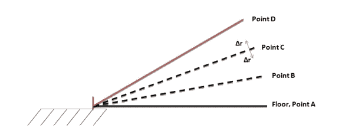
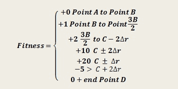

# 自学习直升机使用神经网络

> 原文：<https://hackaday.com/2014/04/22/self-learning-helicopter-uses-neural-network/>

虽然这个项目使用了一架遥控直升机，但它只是一艘展示由两名康乃尔学生[阿克谢]和[塞尔吉奥]开发的迷人的[机器学习算法](http://people.ece.cornell.edu/land/courses/ece4760/FinalProjects/s2012/sab323_and43/Website_sab323_and43_EvolvingHelicopter/website_evolvinghelicopter.html)的船只。学习环境是以直升机为中心，连接在吊杆上。吊杆将直升机的运动限制在一个自由度内，因此它只能从地面向上移动(不能左右或前后移动)。

目标是让直升机学会如何在最短的时间内到达特定的高度。一些红外传感器用来告诉 Atmega644 直升机有多高。这一点的天才之处在于固件。[阿克谢]和[塞尔吉奥]正在使用一种进化算法，这种算法是从著名的生物人工智能作家弗罗里亚诺等人那里借鉴来的。想法是让直升机创建随机“运行”,然后检查数据。更接近目标的跑步得到改进，而其他跑步被淘汰，从而模仿进化的自然选择。

我们以前见过[神经网络](http://hackaday.com/2012/01/03/nerual-networks-control-a-toy-car/)，但没有像这样的。休息过后，请继续关注我们，我们将这个了不起的项目缩小范围，以便您也可以在您的下一个项目中实现这种类型的算法。

 
考虑上图。目标是让直升机从 A 点出发，到 C 点并悬停。分配的时间是每次 10 秒。它必须学会如何做到这一点，而且要尽可能快。记住，它通过红外传感器知道这些点在哪里。[阿克谢]和[塞尔吉奥]使用[分段函数](http://en.wikipedia.org/wiki/Piecewise)开发了一个方程，以确定哪些运行在最长时间内最接近 C 点。

上述等式中的每个点都是通过来自 IR 传感器的电压得知的，其中点 A 为 0.1 伏，点 D 为 3.7 伏。该等式旨在给出在 c 点花费的最长时间的最大值。该值称为适应值。

神经网络用于确定油门应该处于什么水平以实现最高的适应值。这个网络是由固件中运行的进化算法组成的。基本上，它从随机值开始，产生随机的节流水平。达到最高适应值的值被“变异”，而其他值被丢弃。

值的突变是随机进行的，并且该过程重复进行。最后，固件学习最佳节流水平，以实现在分配的 10 秒内最长时间处于 C 点的目标。

请务必检查这个链接的项目，以了解在源代码中执行这些突变的完整细节。