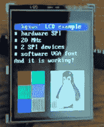

# 带以太网模块的 I2S 音频和 SPI 显示器

> 原文：<https://hackaday.com/2014/04/23/i2s-audio-and-spi-display-with-an-ethernet-module/>

[kgsws]正在做一个小项目，需要一些音频和某种显示。虽然这个项目可以通过大型微控制器或 ARM 板轻松完成，但他采取了一种更简单的路线:整个项目[围绕一个廉价的路由器模块](http://kgsws.tumblr.com/post/83408093191/hlk-rm04-with-i2s-and-spi)构建，以非常微薄的价格为这个项目提供了惊人的可扩展性。

问题中的路由器模块是 Hi-Link 公司的 [HLK-RM04](http://wiki.openwrt.org/toh/hilink/hlk-rm04) ，通常在中国经销商那里以 25 美元左右的价格买到。该模块上有一个 UART、以太网和一个 WiFi 适配器，以及几个用于与外界接口的 GPIO 引脚。

[kgsws]使用该模块上的原生 SPI 引脚来控制微型 LCD 的时钟和数据线，GPIO 引脚切换片选。还实现了 I2S 音频，用 8 位 DAC MCP 4801 解码。

这是一个将音频和视频放入项目中的非常便宜的解决方案，由于该板具有以太网、WiFi 和一些 GPIO 引脚，它可以做的事情比[kgsws]下一步计划的事情多得多。