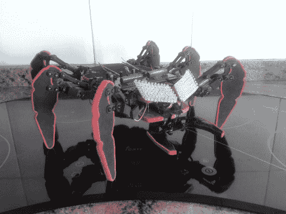

# hex drake——一种低成本二自由度六足机器人

> 原文：<https://hackaday.com/2014/04/24/hexdrake-a-low-cost-2-dof-hexapod/>

[大卫]从 16 岁开始制造机器人。在攻克了基础知识之后，他想建造一个比简单的轮式机器人更有趣的东西——他想买一个六足机器人，但是太贵了——所以他决定自己设计一个低成本的版本！

它由手工切割的木材、SG90 伺服系统、Arduino 和 16 通道伺服控制器制成。一个 2.4GHz 的遥控器向 Arduino 发送命令，然后 Arduino 与 USC 伺服控制器通信，允许对组成 HexDrake 的 14 个伺服系统进行复杂的控制。

他还为他的机器人的眼睛添加了一些 LED 阵列，在未来，这些阵列将被动画化，以表达他的小六足动物。

这是一个建造得非常好的小机器人，并且[大卫的]为任何想跟随他脚步的人提供了非常深入的指导。休息后留下来看它跑来跑去！

[https://www.youtube.com/embed/ORFg-BbFJXM?version=3&rel=1&showsearch=0&showinfo=1&iv_load_policy=1&fs=1&hl=en-US&autohide=2&wmode=transparent](https://www.youtube.com/embed/ORFg-BbFJXM?version=3&rel=1&showsearch=0&showinfo=1&iv_load_policy=1&fs=1&hl=en-US&autohide=2&wmode=transparent)

[https://www.youtube.com/embed/6YMuhP6cBas?version=3&rel=1&showsearch=0&showinfo=1&iv_load_policy=1&fs=1&hl=en-US&autohide=2&wmode=transparent](https://www.youtube.com/embed/6YMuhP6cBas?version=3&rel=1&showsearch=0&showinfo=1&iv_load_policy=1&fs=1&hl=en-US&autohide=2&wmode=transparent)

想要更恐怖更大的东西，请看这只 16 磅重的六足动物！没有，尽管价格低廉…