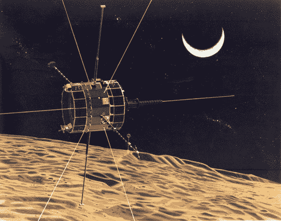

# ISEE 3 号梦之队需要你的帮助

> 原文：<https://hackaday.com/2014/04/28/isee-3-dream-team-needs-your-help/>

拯救 ISEE 3 号的任务正在进行中。ISEE 3 号重启项目已经在 Rockethub 上发布了一项众筹活动。当我们[第一次报道 ISEE 3 号](http://hackaday.com/2014/02/14/call-for-hams-and-hackers-welcome-iceisee-3-home/)的故事时，自 2008 年以来没有人听到过它的消息。从那时起 [AMSAT-DL，德国的一个业余无线电小组已经收到了探测器发出的信号](http://hackaday.com/2014/03/10/isse-3-we-get-signal/)。

ISEE 3 号重启项目由[丹尼斯·温戈]和[基思·考恩]管理，这两个人带头努力从[的旧磁带](http://en.wikipedia.org/wiki/Lunar_Orbiter_Image_Recovery_Project)中恢复美国宇航局的月球轨道飞行器图像。他们的大部分工作是在一家空置的麦当劳使用修复的 20 世纪 60 年代的设备完成的。

ISEE 重启项目的目标是让 ISEE 3 号返回其最初的地球/太阳拉格朗日点 L1 轨道。一旦安全返回轨道，它将被用于 STEM 教育，业余无线电太阳预测，以及关于太阳的科学。用[【丹尼斯·温戈】自己的话说](http://wattsupwiththat.com/2014/04/25/the-international-sun-earth-explorer-isee-3-reboot-project-bringing-an-old-bird-back-to-the-earth-and-back-to-life/)

> 如果我们能做到这一点，我们将拥有第一个低地球轨道上的开源卫星的开源、公开的卫星数据流。

[Wingo]和[Cowing]并不孤单；他们正在和一个古老的梦之队合作。除了得到美国国家航空航天局的认可，该团队还得到了轨道动力学大师 Robert Farquhar 博士]的帮助，他最初设计了 ISEE 3 号的彗星拦截轨道。[Farquhar]参与这个项目有着极其私人的原因。1982 年，他“借”了这颗卫星去寻找彗星。一旦任务完成，他承诺归还 ISEE 3 号。Farquhar 博士]和他的团队在 20 世纪 80 年代设计了将 ISEE 3 号带回 L1 轨道所需的机动动作。这包括在不到 50 公里的高度惊险飞越月球。说真的，我们想看看这家伙在 KSP 的任务。

与 ISEE 3 号通讯需要很大的能量和天线增益。该项目在美国肯塔基州的穆尔黑德州立大学和 T2 的阿雷西博天文台分别安装了一个 21 米的碟形天线。阿雷西博现在应该已经为我们的读者所熟知。穆尔黑德和阿雷西博都收到了来自 ISEE 3 号的信号。reboot 项目小组还直接与德国的 AMSAT-DL 小组合作。

如果这种努力显得有点仓促，那是因为时间非常短暂。为了实施[法夸尔博士的]计划，ISEE 3 号必须在 2014 年 6 月下旬启动推进器。在仅仅两个月的时间里，该团队需要创建软件来实现 ISEE 3 号的通信协议，在穆尔黑德和阿里奇博获得并安装发射机，并向飞船发送一些基本命令。只有到那时，他们才能开始确定 ISEE 3 号的整体健康状况，为推进器燃烧做准备。

如果 ISEE 3 号重启项目成功，我们将拥有一颗远离低地球轨道的可访问卫星。如果失败，伊萨克·牛顿将继续掌舵。seen 号将飞过地球，直到 2029 年 8 月才能再次被看到。

[https://www.youtube.com/embed/TJw3XsmJIUs?version=3&rel=1&showsearch=0&showinfo=1&iv_load_policy=1&fs=1&hl=en-US&autohide=2&wmode=transparent](https://www.youtube.com/embed/TJw3XsmJIUs?version=3&rel=1&showsearch=0&showinfo=1&iv_load_policy=1&fs=1&hl=en-US&autohide=2&wmode=transparent)

[https://www.youtube.com/embed/NZCO5XkwicQ?version=3&rel=1&showsearch=0&showinfo=1&iv_load_policy=1&fs=1&hl=en-US&autohide=2&wmode=transparent](https://www.youtube.com/embed/NZCO5XkwicQ?version=3&rel=1&showsearch=0&showinfo=1&iv_load_policy=1&fs=1&hl=en-US&autohide=2&wmode=transparent)

[https://www.youtube.com/embed/t2YRxdpjce0?version=3&rel=1&showsearch=0&showinfo=1&iv_load_policy=1&fs=1&hl=en-US&autohide=2&wmode=transparent](https://www.youtube.com/embed/t2YRxdpjce0?version=3&rel=1&showsearch=0&showinfo=1&iv_load_policy=1&fs=1&hl=en-US&autohide=2&wmode=transparent)