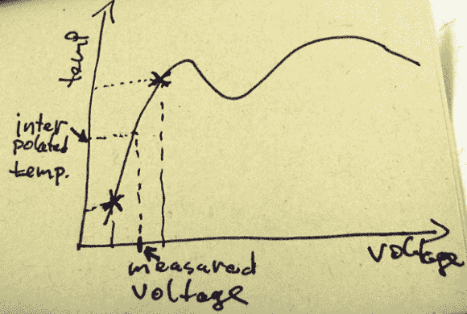

# 微控制器上改进的热电偶

> 原文：<https://hackaday.com/2014/04/26/improved-thermocouples-on-a-microcontroller/>

如果你正在用一个漂亮的 SPI 热电偶放大器读取热电偶，这个不适合你。然而，如果您仍在使用 AD595 等老式模拟热电偶放大器，[miceuz]正适合您。他开发了一个嵌入式设备库，可以读取 k 型热电偶的温度，精确度为【】+-0.03℃】。

如同处理任何自然现象一样，热电偶探头的双金属结产生的电压显然是非线性的。在处理嵌入式设备时，这是一个问题，因为这意味着使用浮点运算，大大增加了代码量。[micuez]找到了 K 型热电偶的 NIST 表，并从 NIST 数据中插入了热电偶探头的实际温度。测量热电偶的常用方法——某种多项式函数——误差约为 0.06°c。[mice uz]库的误差不到这一误差的一半，而且使用的代码更少。

该库不支持零下的温度，但这仍是一项正在进行中的工作。尽管如此，如果你正在寻找一个非常精确的锻造库，瓦罐罐 sous vide build，或者烤面包机烤箱回流控制器，你不可能比[miceuz]的工作做得更好。