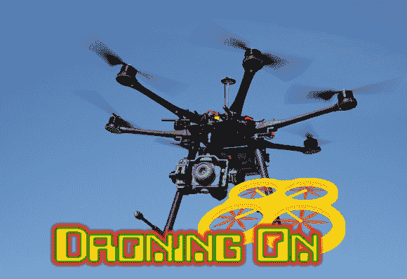

# 无人驾驶飞机的解剖

> 原文：<https://hackaday.com/2014/04/29/droning-on-the-anatomy-of-a-drone/>

在过去的几周里，我一直在为 Hackaday Testbed 订购零件，这是一款将在 Hackaday 使用的基本四轴飞行器。我在多机论坛上看到的首要问题是“我应该买什么”。框架、电机、道具、速度控制器、电池哪个最好？对于较大的四边形(300 毫米或更大)，这些问题没有简单的答案。有无数的选项和几十个供应商可供选择。

在遥控飞机和直升飞机出现在互联网时代之前，建议很简单:去你当地的业余爱好商店，看看他们有什么线路。加入当地的俱乐部，你会有一些伙伴教你飞行。这个建议在一定程度上仍然适用。一些业余爱好商店出售多翼机的 DJI 和刀锋系列。然而，他们的飞行控制系统是闭源的。如果你真的想深入研究和调整参数，你必须要么购买一个开源飞行控制系统的组合包，要么单独购买每个部分。不幸的是，很少有本地的业余爱好商店能够负担得起在这个水平上的库存。

在网络世界中，有几个“大”供应商。美国的经典名字一直是[塔爱好](http://towerhobbies.com/)和[地平线爱好](http://www.horizonhobby.com/HomeView)。一些新的美国公司都是 T4 的现成公司。包括 HobbyKing 和 RcTimer 在内的几家中国公司在世界的几个地方都有仓库。我在这里只列出了几个大人物。如果我漏掉了你最喜欢的网站，请在评论区留下一些信息。

这些公司的杀手锏是供应。一个受欢迎的组件经常会脱销，而且没有任何关于它何时会再次可用的提示。对于电池等单个零件，很容易订购不同的尺寸。但是马达或速度控制呢？这些组件需要在多机上匹配。换一个换一个型号就意味着全部换，所以订购的时候买一两个备用的还是划算的！单击断开处，查看一些多覆面零件的分解。

### **电机**

从无线电控制飞机的早期开始，电力系统就一直是个棘手的问题。选择正确的电源系统很像为电路设计选择正确的微控制器或运算放大器。要考虑的参数似乎无穷无尽。一旦你把它分解，它就不会太难了。

电机零件号通常根据定子或外壳尺寸进行编码。DJI 2212 电机意味着它有一个直径 22 毫米的定子，高 12 毫米。这不是一个硬性规定，所以不要遵守它。电机中第一个也是最重要的参数是 KV–~~每伏特数千~~ RPM。从理论上讲，一个 800 千伏的电动机在 1V 电源下每分钟将转动 800 转。一个 14.8 伏的 4S 脂电池将使马达以每分钟 11840 转的速度旋转。重要的是要记住这是空载额定值。当发动机旋转时，它的转速会显著下降。

下一个要看的数字是电机的额定电压。有时该值用伏特表示，有时用细胞表示，通常指脂肪细胞的 3.7V 标称电压。一个能够处理 4S 电压的电机意味着它对串联的 4 个脂肪细胞或 14.8V 很好

对于 Hackaday 测试平台，我使用了 [NTM 螺旋桨驱动 28-30S 800KV / 300W 电机](http://www.hobbyking.com/hobbyking/store/uh_viewItem.asp?idProduct=43369)。这些发动机成本低，应该有足够的电力为我们的四轴飞行器。

### **速度控制:**

在过去，遥控飞机的油门是由移动开关的伺服系统控制的。要么全力以赴，要么一无所获。值得庆幸的是，那些日子已经过去了，我们有廉价的 MOSFETs 为我们的无刷电机提供数控节流阀。速度控制通常由最大电压和电流来评定。弄清楚买哪一个只是简单地将一个与你计划使用的马达匹配的问题。有时制造商夸大了他们的速度控制能力。因此，留一点开销通常是个好主意，以免放出魔法烟雾。

另一个需要考虑的参数是 SimonK 固件。Simon Kirby 发现许多廉价的速度控制器都运行 Atmel 微控制器。他对一些电路板进行了逆向工程，并编写了自己的[开源固件](https://github.com/sim-/tgy)，具有软启动、校准和简单的参数更新等功能。确保您选择的速度控制与 SimonK 固件兼容。即使兼容，也要检查一下刷控制器的容易程度。有些控制器有容易接近的测试点，有些则需要直接焊接到微控制器上。

对于 Hackaday 测试平台，我使用了 [HobbyKing Blue 系列 30 安培控制器](http://www.hobbyking.com/hobbyking/store/uh_viewItem.asp?idProduct=26497)。

**电池:**

与速度控制非常相似，电池将取决于螺旋桨和马达组合的电流和电压要求。锂聚合物电池组出售时有三个基本参数:电池数量、容量和最大电流。尺寸和重量也很重要——不要买大到你的四轴飞行器举不起来的电池！

3S 和 4S 电池如今在多机中很常见。最大电流通常用“C”表示，即电池的容量。额定为 45C 的 4000mAh 电池可以提供 4 安培的电流 1 小时，或 180 安培的最大电流。不言而喻，对于电池的整体寿命来说，消耗 180 安培不是一个好主意。

对于 Hackaday 测试床，我选择了灵活的 35C 恒定/ 45C 爆裂 4S 4500 lips。

### **螺旋桨:**

多翼螺旋桨甚至会让经验丰富的飞行员感到困惑。道具有两个等级。9×6、8×4 或 10×4.7 都是常见的螺旋桨尺寸。但这一切意味着什么呢？

第一个数字是直径。第二个数字是音高。直径很简单。10×4.7 的螺旋桨直径为 10 英寸。音高有点难。螺旋桨的螺距数描述了螺旋桨在一次旋转中前进的距离。如果你旋转一个 10×4.7 的螺旋桨，理论上它将把你的飞机(或四轴飞行器)向前拉 4.7 英寸。一个 10×6 的螺旋桨将向前推进 6 英寸。事情变得更加复杂——10×4.7 和 9×6 有多大区别？答案是不多。

对于 Hackaday 测试平台，我将测试几个螺旋桨，从保守的 10×4.7 开始。

### **模拟驱动系统:**

虽然螺旋桨和整个驱动系统的性能可以通过手工计算，但计算机可以帮上大忙。有几个软件包可以帮助螺旋桨和驱动系统的选择。 [eCalc](http://www.ecalc.ch/) 是一款基于网站的计算器，有免费试用版和订阅付费版。请确保您选择了正确的计算器，因为它们对于飞机、直升机、电风扇和多机有不同的版本。第二个选择是 [MotoCalc](http://www.motocalc.com/) ，这是一个可下载的软件。MotoCalc 也有限时试用。免费软件选项有 [PropCalc](http://www.drivecalc.de/PropCalc/index.html) 和 [DriveCalc](http://www.drivecalc.de/) 。

然而没有什么能打败真实世界的测试。几年前， [Astro 瓦特计](http://www.astroflight.com/electronics/watt-meters/101d.html)在市场上掀起了一场小小的革命。瓦特计与电池串联，测量驱动系统的总电流和电压。从这些值，它可以计算功率，mAh 使用/剩余和其他几个值。需要记住的一点是，螺旋桨在测试台上(静态推力)和在空中(动态推力)的表现是不同的。为此，有车载瓦特计式系统，既可以发送遥测数据，也可以存储数据供以后下载。

### **如果我只有一个框架**

多翼框架有多种形状和尺寸。两者最基本的区别就是搭载的电机数量。三翼飞机使用三个发动机组成“Y”字形。一个伺服倾斜 Y 底部的电机，以实现偏航控制。三翼飞机的一个优点是所有的螺旋桨都向同一个方向旋转。这意味着标准的飞机道具可以在任何地方使用。

沿着链条向上移动的是四轴飞行器，它使用四个马达和道具。四轴飞行器(以及三轴飞行器以外的所有型号)使用顺时针和逆时针旋转的螺旋桨。当所有四个电机以相同的速率旋转时，由于[扭矩效应](http://en.wikipedia.org/wiki/Torque_effect)产生的偏航被抵消。增加一组电机的油门，同时减少另一组电机的油门，可以进行偏航控制。

除了基本的多直升机类型，我们还有六直升机和八直升机。十六进制和八进制格式的优势当然是更强大！Hexes 和 Octos 可以提升更多，在某些情况下，如果单个马达发生故障，它们可以继续飞行。六角体可以从一个中心点用六个臂来布置，或者它们可以是 Y-6 型。Y-6 本质上是一架三翼直升机，在“Y”的每一点都有堆叠的反向旋转螺旋桨。类似地，八角直升机也可以是八角星，或者 X-8 编队。Y-6 和 X-8 编队提供了减少的重量，由于更少的武器，但是堆叠的螺旋桨总是比两个螺旋桨在干净的空气中运行效率稍低。

另一个要做的决定是材料。在这种情况下，天空基本上是极限。多翼机框架可以简单到几根交叉的木棒，也可以复杂到用编织碳纤维管把板连在一起。套件可以购买，或设计可以手工制作。如果你是临时搭建的，当地的五金店通常是很好的零件来源。我见过从毛巾杆到 PVC 管的所有东西都被压制成多翼机框架的一部分。

Hackaday 测试床将有几个框架，但我从 HobbyKing 的[铝和玻璃纤维模型开始。](http://www.hobbyking.com/hobbyking/store/uh_viewItem.asp?idProduct=42678)

### **飞行控制系统:**

敬请关注这一期。飞行控制和无线电控制系统将有自己的栏目。简单地说，我们将尝试几种，从 [MultiWii](http://www.multiwii.com/) 和 [KK2 多翼](http://www.rcgroups.com/forums/showthread.php?t=1675613)板开始。

哇，这原来是相当长的帖子。直到下一次，继续唠叨！

标题照片由[亚历山大·格林兹]拍摄