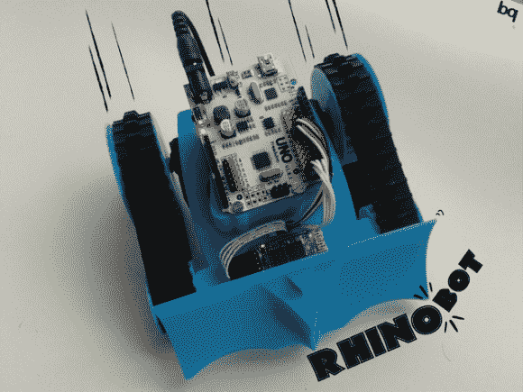

# 开源鼻机器人非常适合黑客和相扑机器人！

> 原文：<https://hackaday.com/2014/04/28/opensource-rhinobot-is-well-suited-for-hacking-and-sumo-robotics/>

RhinoBOT 是一个开源的 3D 打印机器人，构建起来很有趣，也很容易扩展。它可以用于教育目的，甚至可以作为一个机器人！

[米盖尔·卡罗]在[bq.com](http://diy.bq.com/printbots)(西班牙语— [翻译](http://translate.google.com/translate?hl=en&sl=auto&tl=en&prev=_dd&u=http%3A%2F%2Fdiy.bq.com%2Fprintbots%2F))经营着一个 DIY 机器人博客，通过一个名叫安迪的有趣卡通人物来帮助孩子们学习机器人技术。他发布了他最新的打印机器人的所有设计文件，thingiverse.com 上的[鼻机器人。使用一个 Arduino UNO，一个红外传感器，两个旋转伺服系统，一个 LED，电池和一些硬件，你可以建立自己的鼻机器人！也就是说，如果你有一台 3D 打印机。](http://www.thingiverse.com/thing:288663)

然而，乐趣还不止于此，因为[米格尔的]还开发了一个手机应用程序，让你可以无线控制你的鼻机器人！由于没有使用 UNO 上的所有输出，您可以通过一点创意添加额外的功能——移动推土机怎么样！看看它能做什么，并开始考虑你能做什么，休息后留下来看看它的运行！

[https://www.youtube.com/embed/r0RgC5rzKug?version=3&rel=1&showsearch=0&showinfo=1&iv_load_policy=1&fs=1&hl=en-US&autohide=2&wmode=transparent](https://www.youtube.com/embed/r0RgC5rzKug?version=3&rel=1&showsearch=0&showinfo=1&iv_load_policy=1&fs=1&hl=en-US&autohide=2&wmode=transparent)

另一种 3D 打印机器人——自平衡机器人怎么样？