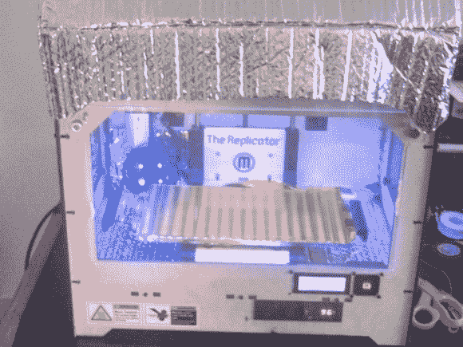

# 复制器 1 接收 PID 控制的加热室

> 原文：<https://hackaday.com/2014/04/28/replicator-1-receives-a-pid-controlled-heated-chamber/>

提高 3D 打印质量有点神奇——你可以对你的打印机做大量的小调整来帮助它，但最终你不得不尝试一切。增加一个[加热成型外壳](http://www.thingiverse.com/thing:312043)几乎可以保证提高 ABS 零件的印刷质量！

还有一个很好的理由——加热成型外壳是杰出的 *[【专利 3D 打印技术】](http://hackaday.com/2013/09/11/3d-printering-key-patents/)——*之一，这就是为什么你看不到任何具有该功能的消费打印机。总之，[布莱恩]刚刚给我们发来了他的 Makerbot Replicator 1 的升级版，这是一个非常漂亮的系统。他的目标是尽可能不引人注目地将加热外壳添加到打印机中——不需要人们认为他的打印机是一个更大的火灾隐患！

我们喜欢[布莱恩的]建造是因为他利用了 PID 控制器，允许他将建造室的温度设置为他想要的任何值(+/- 1 度)。他还决定使用一种高质量的加热器，这种加热器实际上是为加热封闭空间而设计的，这比仅仅扔进一个带风扇的小加热器元件来帮助传播热量要安全得多。关于加热建造室，有一点需要注意——你必须确保不要烧坏你的电子设备或步进器！[Bryan 的]已经使用反射绝缘来帮助保持室内的热量，并在所有步进器上增加了散热片。

如果您更喜欢 RepRap 类型的打印机，我们也为您提供服务！