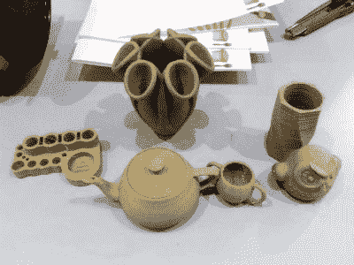

# 稻草纤维？

> 原文：<https://hackaday.com/2014/05/01/straw-based-filament/>

PLA(聚乳酸)通常被认为是消费打印中最环保和最安全的细丝之一，因为它来自玉米产品，而不是化石燃料。但是市场上出现了一个新的竞争者，那就是一种基于稻草的塑料灯丝，它的价格也有望减半！

这种材料由一家名为京和的中国公司设计，是通过研磨各种干燥的作物制成的，如小麦、大米和棉花，在中国，这些作物通常被焚烧处理。然后将锯屑与添加剂如聚丙烯、硅烷偶联剂和乙撑双(硬脂酰胺)混合。然后将其挤压成均匀大小的颗粒，以便于加工。从那里它可以用于注射成型(熔化温度在 160-180 C 之间)，或者进一步挤压成细丝形式。细丝和由此产生的印花是木质颜色，具有有趣的纤维状表面光洁度，具有适当的部件强度。

该公司与汕头市政府签署了一份价值 32 万美元的合同，在欧洲市场生产这种玩具塑料——如果产量增加，它很可能成为最便宜的灯丝之一！

我们喜欢在所有这些[替代灯丝](http://hackaday.com/2013/09/18/3d-printering-alternative-filaments/)出现的时候报道它们，并且有相当多的选择！如果你听说任何用于印刷的新材料，别忘了把它们发送到[提示热线！](http://hackaday.com/contact-hack-a-day/)

[Via[3ders.org](http://www.3ders.org/articles/20140428-straw-based-3d-printer-filament-will-cost-half-the-price-of-pla.html)