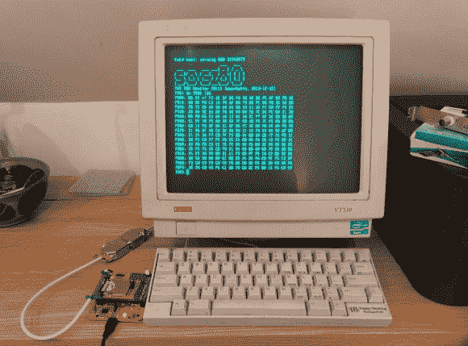

# 用于 Papilio Pro FPGA 板的 Z80 复古微型计算机

> 原文：<https://hackaday.com/2014/05/01/a-z80-retro-microcomputer-for-the-papilio-pro-fpga-board/>

【威尔】[写了一个基于 128MHz Z80 的复古微电脑](http://sowerbutts.com/socz80/)，运行在 [Papilio Pro 板上](http://papilio.cc/index.php?n=Papilio.PapilioPro)。对于那些不知道的人来说，后者是围绕 Spartan-6 LX9 FPGA 构建的，所以你可以想象用 VHDL 实现所有的计算机功能需要做很多工作。T80 CPU 内核取自[open cores](http://opencores.org/project,t80,overview),[SDRAM 控制器](http://hamsterworks.co.nz/mediawiki/index.php/Simple_SDRAM_Controller)来自迈克·菲尔德的作品，但【威尔】自己实现了几个附加功能:

–4KB 分页[内存管理单元](http://en.wikipedia.org/wiki/Memory_management_unit)将 16 位(64KB)逻辑地址空间转换为 26 位(64MB)物理地址空间。

–16KB 直接映射高速缓存，使用 FPGA 内部块 RAM 隐藏 SDRAM 延迟

–用于外部通信的 UART 接口

他还把 CP/M-2.2、MP/M-II 和 UZI(一种 UNIX 系统)移植到了电脑上。他的项目是完全开源的，所有的源代码都可以在[Will]的文章末尾下载。

谢谢[仓鼠]的提示。