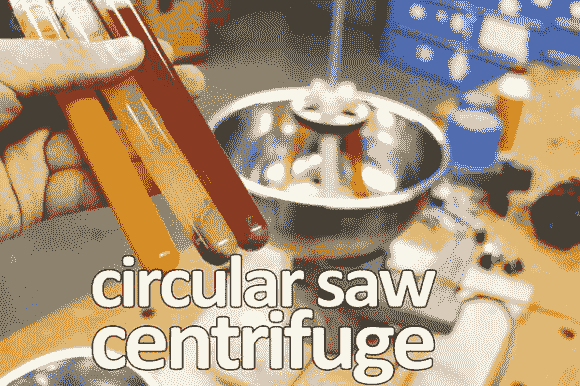

# 厨房里的圆锯，好主意还是最好的主意？

> 原文：<https://hackaday.com/2014/05/02/circular-saws-in-the-kitchen-good-idea-or-best-idea/>

[迈克·沃伦]想出这个宏伟的装置时，正在考虑他能做的有风险但令人兴奋的项目。用旧圆锯做成的[离心机](http://www.instructables.com/id/Circular-saw-centrifuge/)！

第一个问题——为什么？如果你是一个美食家或者你喜欢研究[分子美食学](http://en.wikipedia.org/wiki/Molecular_gastronomy)，把离心机带到厨房可以做一些更技术性的菜。突然之间，根据密度来分离食物成为可能，就像它在实验室中的工作方式一样。超级美味菜肴的实际应用——我们不太确定——但它涉及相对不安全的电动工具和食物，所以我们觉得有义务分享它！

让我们从一般的警告开始—事实上，[Mike]在 Instructable 开始之前就声明了这一点:

> 不要复制这个项目，它非常危险！

该项目利用一个旧的有绳圆锯、几个沙拉碗、一些螺纹杆、几个螺母、一些活页夹和一些金属板来固定塑料试管。在每分钟 4900 转(锯子的速度)时，他[计算出他的重力](http://www.endmemo.com/bio/grpm.php)大约是 1879G。天啊。一个人在大约 10 个重力加速度下昏倒，一把普通手枪发射的子弹超过 50，000 颗——在极端情况下，一台专业实验室超离心机可以达到 300，000 多颗。

与大型强子对撞机相比，这些当然都相形见绌，大型强子对撞机可以以大约 190，000，000G 的速度加速质子！总而言之，这就是实验室离心机爆炸时发生的事情。不要这样做——但一定要看下面的视频，尽情享受吧！

[https://www.youtube.com/embed/oQjyql_gGg0?version=3&rel=1&showsearch=0&showinfo=1&iv_load_policy=1&fs=1&hl=en-US&autohide=2&wmode=transparent](https://www.youtube.com/embed/oQjyql_gGg0?version=3&rel=1&showsearch=0&showinfo=1&iv_load_policy=1&fs=1&hl=en-US&autohide=2&wmode=transparent)