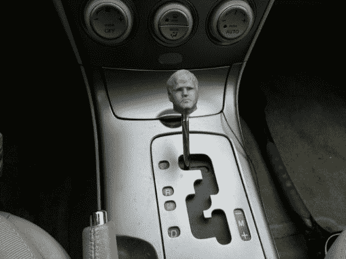

# 3D 打印杆换档手柄

> 原文：<https://hackaday.com/2014/05/03/3d-printed-stick-shift-handle/>

这是给你们的一个愚蠢的建议。把你的头(或其他任何东西)变成一个换挡手柄！

抛开所有关于虚荣心的玩笑，[Haqnmaq]已经概述了一个关于如何进行 3D 扫描、操作它们并使它们为 3D 打印机做好准备的极好的指导。他选择使用微软 Kinect(T1 附近最便宜的 3D 扫描仪之一)和一些低成本的 3D 软件。他成功地使用了 [Skanect](http://skanect.manctl.com/) 和 [Reconstructme](http://reconstructme.net/) ，这两个软件都有免费版本(尽管有所限制)。他用于变速杆的模型实际上是在芝加哥的 3D 打印体验会上拍摄的。

无论如何，一旦你把你的 3D 扫描变成了一个. STL 文件，它只需要被导入到 [Netfabb Basic](http://www.netfabb.com/basic.php) 中，在 3D 打印之前进行必要的修复。找出你的变速杆使用的螺母的尺寸，在你的模型中添加一个剪切挤出(他用 Autodesk 的 123D 设计软件来做这个)，打印出来，粘上螺母，你就完成了！

不管你是否想让你的脑袋换挡，这都是 3D 扫描到 3D 打印的绝佳入门。