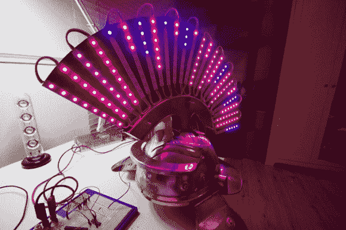

# 罗马头饰看起来不那么傻，有很多亮闪闪的东西

> 原文：<https://hackaday.com/2014/05/03/roman-headgear-looks-less-silly-with-lots-of-blinky/>

听着，这不是蒸汽朋克，因为这个时代已经不正常了。我们从来没有在派对上把自己当成“那个人”。但是，开发“百夫长”项目并把它带到你可能参加的每一个节日聚会上是相当困难的。[这个声音感应头盔以一种新的方式迫使人们参加派对。](http://rom.io/The-Centurion-Project)

[Roman]告诉我们它是从一个电影道具开始的。第一步是从顶部移除羽状物。这个替代品——7 米长的可寻址 RGB LEDS——看起来就像一个史诗般的莫霍克发型，足以引发朋克摇滚秀的视觉效果，反应模式让它变得愚蠢。意想不到的是 FFT 生成的音频可视化。它们在每个 LED 灯带的顶部接地。大多数人会说这是颠倒的，但它最终是这个版本的决定性因素。说真的，请在休息后观看演示，并尝试让您的案例表明，如果换个方式会更好。

最后说明一下，这个项目是用 [Cinder](http://libcinder.org/) 编写的。这是一个开源的 C++库，我们不记得以前听说过。

[https://player.vimeo.com/video/93061833](https://player.vimeo.com/video/93061833)[https://player.vimeo.com/video/93439124](https://player.vimeo.com/video/93439124)