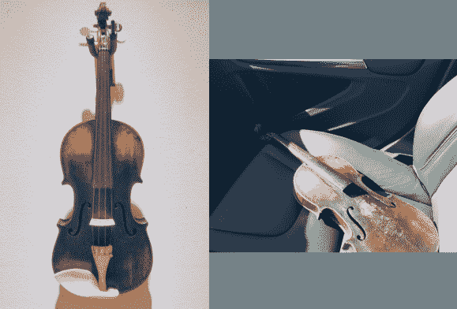

# 用 3D 打印零件修复小提琴

> 原文：<https://hackaday.com/2014/05/04/restoring-a-violin-with-3d-printed-parts/>

家家都有传家宝。它可能是一块手表，一本书，或者一个毛绒玩具。[迈克的]传家宝是一把古董小提琴。不是一整把小提琴。这把特殊的小提琴由一个分离的琴颈、琴身和一个调音栓组成。据[迈克]所知，他的家人中没有一个活着的人听过这首曲子。[迈克]决定[恢复到可玩状态](http://milwaukeemakerspace.org/2014/05/ressusciter-les-mort/)。

[迈克的]小提琴是在他的家人从法国移民时被带到美国的。它被保存下来的主要原因是因为它被命名为斯特拉迪瓦里。斯特拉迪瓦里的复制品和贡品在野外随处可见。许多复制品现在都是古董，本身就是很好的演奏乐器，尽管远不如真品受人尊敬。[迈克]第一步是确定他的小提琴是真品还是仿制品。幸运的是，他能够与密尔沃基一条真正的流浪狗的管理员取得联系。原来他小提琴上的标签标明是复制品。据管理员说，真正的斯特拉迪瓦里乐器是直接在木头上签名的。管理员还能确定[迈克的]小提琴大约有 100 年的历史，在当时是相对便宜的型号。

虽然它不是真正的斯特拉迪瓦里，但小提琴仍然是[迈克]家族历史的重要组成部分，值得再次演奏。[Mike]决定使用密尔沃基制造商空间的资源来创建 3D 打印零件，而不是重新创建缺失的零件来与原件完美匹配。

类似的小提琴零件在创客空间被扫描。决赛。stl 文件被发送到 Shapeways 进行打印。[Mike]将所有零件送到制琴师那里进行最后的装配和组装。[迈克的]传家宝不再是一件需要藏起来的物品，而是供新一代人享用的活生生的呼吸器具。