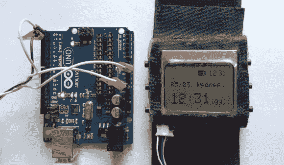
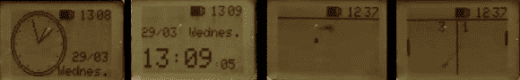

# 用 WatchDuino 显示时间并闪烁手腕上的 LED

> 原文：<https://hackaday.com/2014/05/06/tell-time-and-blink-an-led-on-your-wrist-with-watchduino/>

你的潮人手腕是不是在苦苦等待 iWatch 的登场？有一个新的开放硬件/软件项目可以帮助你平静神经。WatchDuino 正如其名，是一款基于 Arduino 的腕表。

组件列表很短，也很便宜。肉和土豆由 ATMega328、水晶、诺基亚液晶显示屏和 LiPo 电池组成。USB 充电电池可以持续使用一周左右。除了以模拟或数字格式显示时间和日期(如你所料)，还有一个闹钟和计时器。此外，还有两个游戏，乒乓和贪吃蛇。软件是开放的，可以由社区修改和添加，这一事实弥补了任何功能的不足。我们确信这款手表的发展将会迅速而显著。

在 2014 年 [BIICODE 编程竞赛](https://www.biicode.com/biicontest2014_first_winner#.U2liJPldX54)中获得第一名的事实证实了这个项目的酷。如果 WatchDuino 正合你的胃口，文档可以在这里[找到。去做一个！](//bitbucket.org/rephus/watchduino/overview)

[https://www.youtube.com/embed/CtgR1YiwnEY?version=3&rel=1&showsearch=0&showinfo=1&iv_load_policy=1&fs=1&hl=en-US&autohide=2&wmode=transparent](https://www.youtube.com/embed/CtgR1YiwnEY?version=3&rel=1&showsearch=0&showinfo=1&iv_load_policy=1&fs=1&hl=en-US&autohide=2&wmode=transparent)

谢谢[哈维尔]