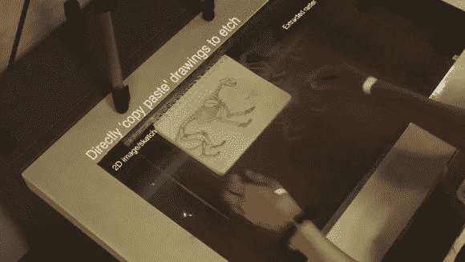

# 增强型激光切割机消除了设计技术障碍

> 原文：<https://hackaday.com/2014/05/09/augmented-laser-cutter-removes-design-technology-barriers/>

激光切割机、3D 打印机、CNC 路由器——它们都是掌握在合适人手里的伟大技术，但不幸的是，学习曲线有时会让潜在的制造者望而却步。来自麻省理工学院媒体实验室的[Anirudh]正试图用他的增强激光切割系统[clear cut 打破至少一个障碍。](http://vimeo.com/92121110)

该系统由网络摄像头、投影仪和激光切割机顶部的半透明工作空间组成。通过将物体放在表面上，网络摄像头可以识别它们，用投影仪复制它们，然后用激光雕刻它们。除了这种“复制和粘贴”的想法，您还可以使用红外发射笔在要雕刻的工作表面上实际绘制您的设计。它开始在复杂的 CAD 和纸笔之间架起一座桥梁，这是任何人都能做到的。

[https://player.vimeo.com/video/92121110](https://player.vimeo.com/video/92121110)

不幸的是，这个软件不是开源的，但是这个想法是存在的，它提供了一个有趣的想法来改变做事的方式。事实上，它与我们几个月前分享的[可施工项目](http://hackaday.com/2013/11/09/constructable-interactive-laser-cutting/)非常相似——除了投影仪。