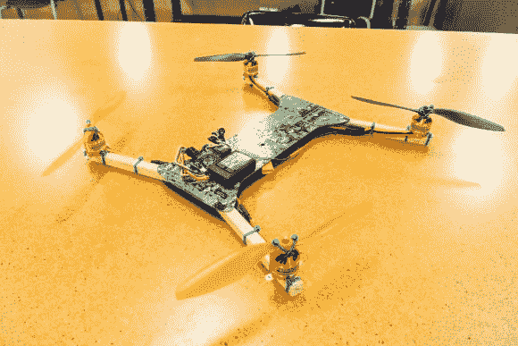
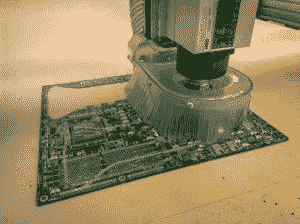

# 用回收的主板制造的四轴飞行器

> 原文：<https://hackaday.com/2014/05/09/quadcopter-built-from-recycled-motherboards/>

[Eric]想出了一个用回收的电脑主板制造四轴飞行器的好方法。如今，多翼飞机有各种形状和大小。正如我们在上一期的[中提到的，它们也可以购买或内置于多种材料中。无人机是用木材、PVC 管、碳纤维和铝等各种材料制造的。](http://hackaday.com/2014/04/29/droning-on-the-anatomy-of-a-drone/)

一种更常见的商业材料是 G10 玻璃纤维板。它很硬，很结实，而且相对较轻。印刷电路板通常由 G10 的耐火同类 [FR-4 玻璃纤维](http://en.wikipedia.org/wiki/FR-4)制成。难怪[Eric]在他的大学里看到一堆主板被扔出去的时候，眼里会有四轴飞行器。

[Eric]使用热风枪和极大的耐心将所有组件从主板上取下。只要稍加小心，大部分组件都可以保存下来供将来的硬件黑客使用。这一步最好在室外进行。热熔塑料、金属和树脂烟雾不是最容易吸入的东西。

手里拿着清洁过的多氯联苯，[Eric]走向他当地的技术商店。他在 SolidWorks 中绘制了死猫风格的框架，并在一个商店机器人上将其裁剪下来。虽然高端数控切割机很好，但不是绝对必要的。玻璃纤维板可以用旋转工具或线锯切割。不管你怎么剪，一定要戴上玻璃纤维树脂等级的口罩和一些防护服。玻璃纤维板很难切割。

一旦上下框架板被切割后，[埃里克]就用一些方形的木制手臂完成了他的方形框架。最终的四轴飞行器是一个伟大的飞行器，备件很容易获得。回收工作做得很好，[Eric]！

[https://www.youtube.com/embed/Z7V8MY-O4QY?version=3&rel=1&showsearch=0&showinfo=1&iv_load_policy=1&fs=1&hl=en-US&autohide=2&wmode=transparent](https://www.youtube.com/embed/Z7V8MY-O4QY?version=3&rel=1&showsearch=0&showinfo=1&iv_load_policy=1&fs=1&hl=en-US&autohide=2&wmode=transparent)