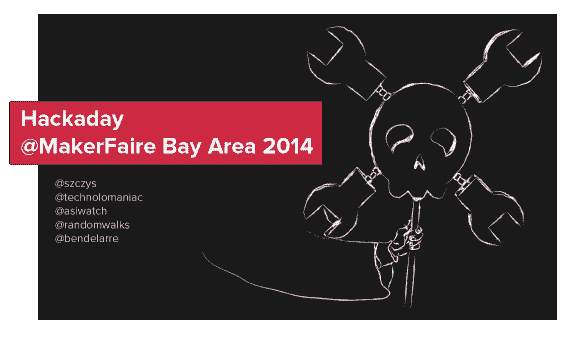
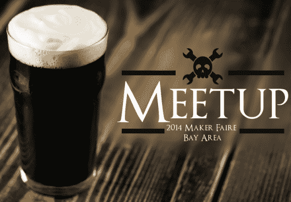

# 制造者集会上的黑客日

> 原文：<https://hackaday.com/2014/05/09/hackaday-at-maker-faire/>

如果你计划 5 月 17 日和 18 日去 Maker Faire 湾区旅行，为什么不去追捕 Hackaday 的船员呢？我们会打包成吨的礼物发给任何想要的人。但理想情况下，我们想展示我们能找到的最好的硬件，所以不要空手而来！

想在 Hackaday 上看到你的创客集会吗？你可以提前发微博让我们知道你什么时候去，你会带些什么。你也可以在周末追踪我们，因为我们会经常在推特上发布我们的位置。以下是我们正在计划的一些庆祝活动的联系人列表和信息:

我们制作了一份 Twitter 账号列表，您也可以单独关注:

*   迈克:“t0”@峰值”
*   马特:[@技术狂](https://twitter.com/technolomaniac)
*   茉莉: [@asiwatch](https://twitter.com/asiwatch)
*   Alek: [@randomwalks](https://twitter.com/randomwalks)
*   本:[@本德拉雷](https://twitter.com/BenDelarre)

#### 我喜欢啤酒

创造者大会不是 24 小时开放的！你能相信他们晚上会把你赶出去吗？

星期六晚上我们要去酒吧。我们已经找到了一家，离这里只有一站的距离。如果你想顺道从我们这里拿一件，我们会带衬衫(白天我们不太可能带着衬衫去游乐场)。要考虑的一件事是酒吧只能容纳 80 人。登记一张票 …你可以在没有票的情况下随时过来，但要做好准备，因为旅馆已经没有房间了。