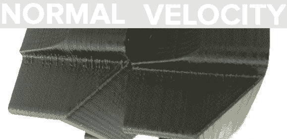

# 用速度挤压进行 Blobless 印刷

> 原文：<https://hackaday.com/2014/05/10/blobless-printing-with-velocity-extrusion/>

目前的 3D 打印机在技术上是四轴机器，三个轴移动，第四个轴用于灯丝的位置。[Bas]有一个完全不同的想法—[为什么不将挤出机的速度与喷嘴的速度联系起来](http://basdebruijn.com/2014/05/machinekit-and-additive-manufacturing/)？事实证明，这种技术给你更多的“塑料外观”的打印，并大大减少了斑点。

[Baz]一直在与 LinuxCNC、BeagleBone Black 和 BeBoPr-Bridge cape 合作，该系统在将许多直线变成一个平滑的圆弧方面有了很大的发展。这导致他在打印机运行时调整喷嘴的流速，但如果像在传统打印机设置中那样通过位置来控制挤出，这是很困难的。一种新的结构正在形成。

[Baz]最终得到的是一个配置，它根据喷嘴在打印表面上移动的速度来计算挤出机的速度。这使他能够添加实时喷嘴压力调节，结果，出现在每层开始处的小气泡几乎完全消失。

对于校准良好的机器来说，控制挤出速率的“正常”和“速度”方法之间只有很小的差别。不过，这是一个明显的区别，而且极大地提高了印刷品的视觉质量。