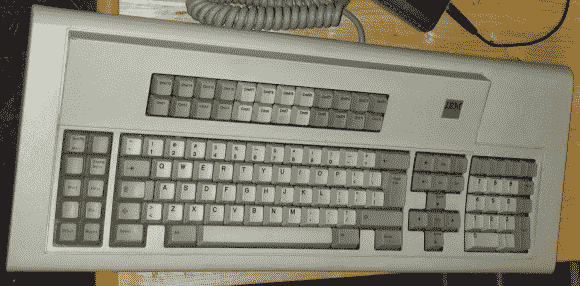
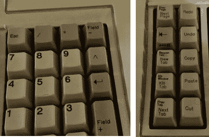

# 激光蚀刻给 IBM 键盘带来新的生命

> 原文：<https://hackaday.com/2014/05/13/laser-etching-brings-new-life-to-an-ibm-keyboard/>

[Evan]在当地的旧货店仔细阅读时，他发现了一个漂亮的 1987 年生产的 IBM m122 键键盘。

> “这是我的键盘，有很多类似的，但这一个是我的。”
> 
> ~打字员的信条

在[埃文的]案例中，这可能实际上是今天唯一一个还在使用的**一模一样的。一个想法在他脑海中形成。如果他拿着这个古老的键盘，给它一个 USB 驱动程序，并在硬件层面上定制按键[来做他想要的事情，会怎么样？](http://abzman2k.wordpress.com/2014/03/17/ibm-model-m-122key/)**

第一步是把它转换成 USB。他使用 Teensy 2.0 主要是因为它超级便宜，并且可以充当 USB HID 设备。除了将键盘连接到 Teensy，他还添加了通过 1/8”立体声插头连接的脚踏板——这有点像额外的鼠标按钮，允许他从左到右滚动画廊，添加分页符和其他宏以提高效率。

这样一个旧键盘有许多键已经不存在了，有些键完全不见了，比如 Windows 键。[Evan 的]下一步是重新标记新功能的按键。作为当地黑客空间 [i3Detroit](http://www.i3detroit.org/) 的一员，他希望能够简单地用激光在自己的钥匙上蚀刻出新的符号。可悲的是，无论他们尝试什么样的设置，最终都只是融化了塑料。他们发现了一些可能有用的东西——一种叫做 Thermark 的产品，一种奇妙的(而且昂贵的！)用低功率激光粘合到金属上的产品。经过一些实验后，他们发现他们也能让它可靠地粘合到塑料上！

通过一点练习，他们能够在按键上涂上印记，在顶部进行激光蚀刻，然后清除多余的材料，留下清晰的文字。还不错！

当然，如果你愿意的话，你也可以从零开始制作一个完整的机械键盘