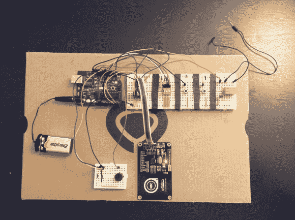

# 用 Arduino 和 RFID 升级你的车库门

> 原文：<https://hackaday.com/2014/05/13/upgrade-your-garage-door-with-arduino-and-rfid/>

[Jason]非常想制造一个 RFID 控制的[车库门开启器](https://bitbucket.org/jason955/arduino-access-control "garage door opener")，并决定求助于 Arduino 来完成这项工作。对于一个从未使用过 Arduino 的人来说，他似乎真的知道自己在做什么。

Arduino 充当操作的大脑，而现成的 NFC/RFID 读取器模块用于读取 RFID 标签。要向系统添加新钥匙，[Jason]只需刷一下他的“主”RFID 钥匙。指示灯 LED 亮起，压电扬声器发出蜂鸣声，让您知道系统已准备好读取新密钥。一旦新密钥被读取，地址就被存储在 EEPROM 中。从那时起，新的钥匙被允许激活系统。

每当一个有效的键被刷过，Arduino 就会触发一个继电器，这个继电器可以用来控制任何东西。在这种情况下，[杰森]计划用它来控制他的车库门。该系统也有一些手动控制。首先是重置按钮。如果按住此按钮两秒钟，EEPROM 中的所有键都将被擦除。这个按钮显然只对已经在车库里的人可用。还有一个 DIP 开关，允许用户选择继电器电路保持开路的时间。这可以 100 毫秒为增量进行配置。

目前，电路连接在几个试验板上，但使用更永久的东西可能是个好主意。[Jason]总是可以更进一步，学会[蚀刻自己的 PCB](http://hackaday.com/2013/03/04/frans-pcb-etching-techniques/ "etch your own PCB's")。或者，他甚至可以在 [Eagle CAD](http://hackaday.com/2011/08/29/video-learning-eagle-cad-part-i-schematic-custom-parts/ "Eagle CAD") 中设计一个电路板，并订购一个[真正的印刷电路板](http://hackaday.com/2010/06/15/preparing-your-pcb-design-for-manufacture/ "real printed board")。不要错过下面 RFID 系统的视频描述。

[https://www.youtube.com/embed/TP8UfJgs2lU?version=3&rel=1&showsearch=0&showinfo=1&iv_load_policy=1&fs=1&hl=en-US&autohide=2&wmode=transparent](https://www.youtube.com/embed/TP8UfJgs2lU?version=3&rel=1&showsearch=0&showinfo=1&iv_load_policy=1&fs=1&hl=en-US&autohide=2&wmode=transparent)

[via [Reddit](http://www.reddit.com/r/arduino/comments/24vi1n/arduino_rfid_garage_door_opener/ "Reddit.com")