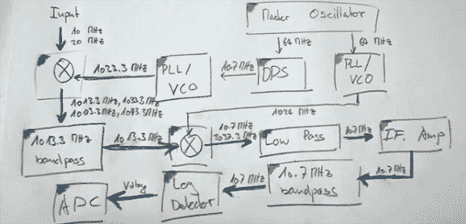

# 模块化 1GHz 频谱分析仪

> 原文：<https://hackaday.com/2014/05/14/a-modular-1ghz-spectrum-analyzer/>

[MrCircuitMatt]最近做了很多无线电维修工作，很快意识到拥有一个频谱分析仪将是一件有用的事情。他想，既然能造一台，为什么还要买一台呢？他很快开始温习自己的射频技术，并计划设计一台 1000 MHz 的频谱分析仪

该项目基于 Scotty 的频谱分析仪，这是一种扫描模式的模块化 1GHz 频谱分析仪，不幸的是，它完全是在 ExpressPCB 中设计的。[Matt]不喜欢将这种专有设计软件局限在一个单独的板房中。[Scotty]的频谱分析仪的基本构件被转移到 KiCAD，电路板被送到一个普通的中国板房。

在第二个视频[中，【Matt】讲述了控制板的设计，这是一个将频谱分析仪连接到 PC 并行端口的小模块。在这个小电路板上有许多经过深思熟虑的设计，这也是一件好事，因为他用开关模式电源为 VCO 供电。控制板有一个 32 位 I/O，那么他是如何使用并行端口实现这一点的，最终的 8 位端口是什么？四路 74ACT573，带锁存使能的四路缓冲器。利用并行端口上的八条数据线，他可以切换一些引脚，而并行总线上的古老引脚——选通、选择打印机和换行——控制每个缓冲器上的锁存器。这使他能够通过并行端口写入频谱分析仪中的 32 个不同引脚。](https://www.youtube.com/watch?v=qQwltSSBd6E)

现在，[Matt]正在完成他的控制板的构建，其他模块也将很快完成。他认为完整的分析仪甚至可能比专业的商业产品更便宜，我们迫不及待地想看到另一个更新视频。

[https://www.youtube.com/embed/WL7jMLv9MTE?version=3&rel=1&showsearch=0&showinfo=1&iv_load_policy=1&fs=1&hl=en-US&autohide=2&wmode=transparent](https://www.youtube.com/embed/WL7jMLv9MTE?version=3&rel=1&showsearch=0&showinfo=1&iv_load_policy=1&fs=1&hl=en-US&autohide=2&wmode=transparent)

[https://www.youtube.com/embed/qQwltSSBd6E?version=3&rel=1&showsearch=0&showinfo=1&iv_load_policy=1&fs=1&hl=en-US&autohide=2&wmode=transparent](https://www.youtube.com/embed/qQwltSSBd6E?version=3&rel=1&showsearch=0&showinfo=1&iv_load_policy=1&fs=1&hl=en-US&autohide=2&wmode=transparent)

[https://www.youtube.com/embed/Sl6mFk-byJA?version=3&rel=1&showsearch=0&showinfo=1&iv_load_policy=1&fs=1&hl=en-US&autohide=2&wmode=transparent](https://www.youtube.com/embed/Sl6mFk-byJA?version=3&rel=1&showsearch=0&showinfo=1&iv_load_policy=1&fs=1&hl=en-US&autohide=2&wmode=transparent)