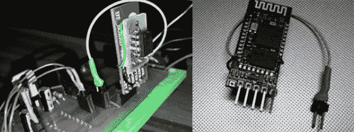

# 用极其便宜的蓝牙适配器给微型计算机编程

> 原文：<https://hackaday.com/2014/05/14/programming-micros-with-impossibly-cheap-bluetooth-adapters/>

[Zenios]和[Raivis]正在建造一个小型的平衡机器人，为了与外界通信，他们使用了一个非常便宜的小型蓝牙适配器。他们认为通过蓝牙将代码上传到微控制器是个好主意，但是他们的适配器，一个廉价的 HC-06 模块，没有办法重置微控制器；它只是为 Tx 和 Rx 提供了串口。他们确实注意到当设备没有连接到适配器时，LED 会闪烁，[所以用一个简单的电路](http://morf.lv/modules.php?name=tutorials&lasit=30)他们在不需要的地方组装了一个复位电路。

HC-06 模块上的小 LED 在无连接时闪烁，在建立连接时保持亮起。考虑到新的连接将是上传新代码的好时机，这些人需要设计一个电路，当 LED 闪烁时保持低电平，当 LED 亮起时切换到高电平。

一个简单的 RC 滤波器处理闪烁的 LED，使线路保持低电平，直到有设备连接。当 LED 保持稳定时，将逻辑电平拉高需要翻遍一个零件抽屉，最终找到一个 LM741 p 差分放大器。

在对 bootloader 进行了一些小的更改后，这些人有了一种可靠的方法来刷新新的固件，而不需要编程适配器或覆盖在他们工作空间上的电线，所有这些都使用了不应该具有这种功能的蓝牙适配器。下面视频。

[https://www.youtube.com/embed/-ieN9893igc?version=3&rel=1&showsearch=0&showinfo=1&iv_load_policy=1&fs=1&hl=en-US&autohide=2&wmode=transparent](https://www.youtube.com/embed/-ieN9893igc?version=3&rel=1&showsearch=0&showinfo=1&iv_load_policy=1&fs=1&hl=en-US&autohide=2&wmode=transparent)